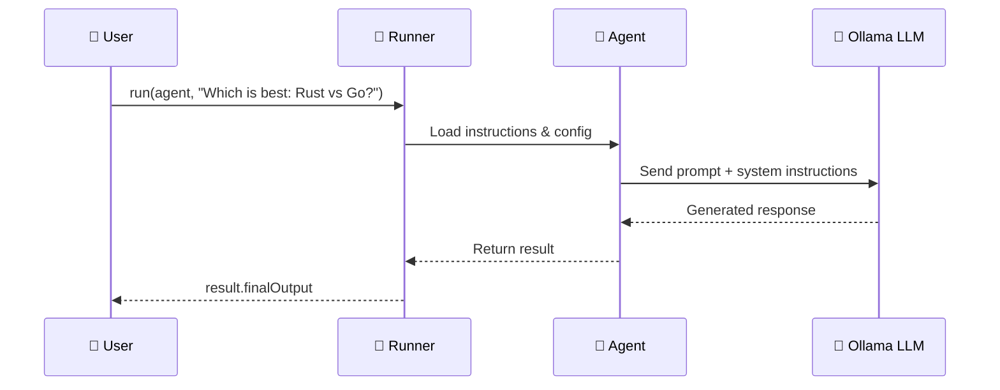
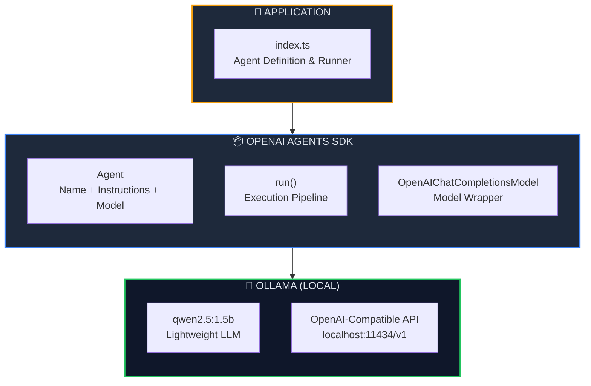

<p align="center">
  
  
  
  
</p>

<h1 align="center">🤖 First Agent Setup — OpenAI Agents SDK</h1>

<p align="center">
  <strong>Build your first AI agent in minutes — fully local, zero cloud, total privacy.</strong><br/>
  Powered by <a href="https://github.com/openai/openai-agents-js">OpenAI Agents SDK</a> &amp; <a href="https://ollama.com">Ollama</a>.
</p>

<p align="center">
  <a href="#-quick-start">Quick Start</a> •
  <a href="#-what-is-an-ai-agent">What is an Agent?</a> •
  <a href="#-key-concepts">Key Concepts</a> •
  <a href="#%EF%B8%8F-architecture">Architecture</a> •
  <a href="#-advanced-usage">Advanced</a>
</p>

---

## 📖 Overview

This project is a **minimal starter** demonstrating how to build your **first AI agent** using the [OpenAI Agents SDK](https://github.com/openai/openai-agents-js) with **TypeScript** and **Ollama** as a local LLM backend. No cloud services, no paid API keys — everything runs on your machine.

### ✨ Key Highlights

| Feature | Description |
|---------|-------------|
| 🤖 **First Agent** | Create a conversational AI agent in under 30 lines of code |
| 🔒 **100% Local** | All inference runs on your machine via Ollama |
| 💰 **Zero Cost** | No API keys or subscriptions required |
| ⚡ **Blazing Fast** | Bun runtime + local inference = instant responses |
| 🔌 **Drop-in Compatible** | Swap to OpenAI cloud models with a single line change |
| 📐 **TypeScript First** | Full type safety with the OpenAI Agents SDK |

---

## 🧠 What is an AI Agent?

An **AI Agent** is more than a chatbot — it's an autonomous program that can reason, plan, and take actions. The OpenAI Agents SDK provides a structured framework to define an agent's personality, model, and execution pipeline.

### Agent vs Chatbot

| Aspect | Simple Chatbot | AI Agent |
|--------|:--------------:|:--------:|
| Text responses | ✅ | ✅ |
| System personality | ❌ | ✅ |
| Structured pipeline | ❌ | ✅ |
| Tool calling | ❌ | ✅ |
| Multi-step reasoning | ❌ | ✅ |
| Model-agnostic | ❌ | ✅ |
| Tracing & observability | ❌ | ✅ |

### How the Agent Pipeline Works



---

## 🏗️ Architecture



### 📂 Project Structure

```
01. First-Agent-Setup/
├── 🎯 index.ts          # Main entry — agent definition & execution
├── 📦 package.json      # Dependencies & project metadata
├── ⚙️ tsconfig.json     # TypeScript compiler configuration
├── 🚫 .gitignore        # Ignored files & directories
├── 🔗 bun.lock          # Bun lockfile
└── 📖 README.md         # You are here
```

---

## 🔑 Key Concepts

### 1. Creating the Ollama Client

The OpenAI SDK is used as a **compatibility layer** to talk to Ollama's local API:

```typescript
import OpenAI from "openai";

const ollamaClient = new OpenAI({
    baseURL: "http://localhost:11434/v1/",  // Ollama's OpenAI-compatible endpoint
    apiKey: "ollama",                       // Required by SDK, ignored by Ollama
    dangerouslyAllowBrowser: true
});
```

> **Key insight:** Ollama exposes an OpenAI-compatible API, so the standard `openai` npm package works out of the box — no special Ollama client needed.

### 2. Wrapping the Model

The `OpenAIChatCompletionsModel` bridges the OpenAI client with the Agents SDK:

```typescript
import { OpenAIChatCompletionsModel } from "@openai/agents";

const ollamaModel = new OpenAIChatCompletionsModel(
    ollamaClient,    // The OpenAI client instance
    "qwen2.5:1.5b"  // The model name running on Ollama
);
```

### 3. Defining the Agent

An agent is created with a **model**, **name**, and **instructions** (system prompt):

```typescript
import { Agent } from "@openai/agents";

const firstAgent = new Agent({
    model: ollamaModel,
    name: "Agent",
    instructions: "You are very Helpful agent that response and resolve the user queries"
});
```

| Property | Purpose |
|----------|---------|
| `model` | The LLM backend (Ollama via `OpenAIChatCompletionsModel`) |
| `name` | A label for identifying the agent |
| `instructions` | System prompt that shapes the agent's personality & behavior |

### 4. Running the Agent

The `run()` function sends a prompt through the agent pipeline and returns the final output:

```typescript
import { run } from "@openai/agents";

async function main() {
    const result = await run(firstAgent, "Which is best Rust vs Go?");
    console.log(result.finalOutput);
}

main();
```

### 5. Disabling Tracing for Ollama

Since Ollama doesn't support OpenAI's tracing infrastructure, tracing must be disabled:

```typescript
import { setTracingDisabled } from "@openai/agents";

setTracingDisabled(true);  // Required when using Ollama
```

> **Note:** Remove this line when switching to OpenAI's cloud models to enable built-in observability.

---

## ⚡ Quick Start

### Prerequisites

| Requirement | Minimum Version | Purpose |
|-------------|:--------------:|---------|
| [Bun](https://bun.sh) | v1.3+ | JavaScript/TypeScript runtime |
| [Ollama](https://ollama.com) | Latest | Local LLM inference server |

### Step 1 — Start Ollama & Pull the Model

```bash
# Start the Ollama server
ollama serve

# Pull the lightweight model used in this project
ollama pull qwen2.5:1.5b
```

### Step 2 — Install Dependencies

```bash
bun install
```

### Step 3 — Create a `.env` file (optional)

```env
# Only needed if switching to OpenAI cloud models
OPENAI_API_KEY=your_key_here
```

### Step 4 — Run the Agent

```bash
bun run index.ts
```

### Expected Output

```
Choosing between Rust and Go depends on your use case:

• Rust — Best for systems programming, memory safety, and performance-critical
  applications. Steeper learning curve but zero-cost abstractions.

• Go — Best for backend services, cloud infrastructure, and rapid development.
  Simpler syntax with built-in concurrency via goroutines.

Choose Rust for control and performance, Go for simplicity and speed of development.
```

---

## 🔧 Advanced Usage

### Switch to OpenAI Cloud Models

Replace the entire Ollama setup with a single model string:

```typescript
// Before (local Ollama)
const ollamaClient = new OpenAI({ ... });
const ollamaModel = new OpenAIChatCompletionsModel(ollamaClient, "qwen2.5:1.5b");
const agent = new Agent({ model: ollamaModel, ... });

// After (OpenAI cloud) — just one line!
const agent = new Agent({ model: "gpt-4o-mini", ... });
```

> **Note:** Set `OPENAI_API_KEY` in `.env` and remove `setTracingDisabled(true)`.

### Try Different Ollama Models

Swap models without changing any code — just pull and update the model name:

```bash
# Pull alternative models
ollama pull llama3.2
ollama pull gemma2:2b
ollama pull phi3:mini
ollama pull mistral
```

```typescript
// Update the model name
const ollamaModel = new OpenAIChatCompletionsModel(
    ollamaClient,
    "llama3.2"    // Changed from "qwen2.5:1.5b"
);
```

### Add a System Persona

Customize the agent's personality via the `instructions` field:

```typescript
// Code reviewer agent
const agent = new Agent({
    model: ollamaModel,
    name: "Code Reviewer",
    instructions: `You are an expert code reviewer. 
        Review code for bugs, security issues, and best practices.
        Be constructive and provide specific suggestions.`
});

// Creative writer agent
const agent = new Agent({
    model: ollamaModel,
    name: "Story Writer",
    instructions: `You are a creative fiction writer.
        Write engaging stories with vivid descriptions.
        Use literary techniques and varied sentence structures.`
});
```

### Multi-Turn Conversations

Chain multiple `run()` calls for context-aware conversations:

```typescript
const result1 = await run(firstAgent, "What is Rust?");
console.log(result1.finalOutput);

const result2 = await run(firstAgent, "How does it compare to C++?");
console.log(result2.finalOutput);
```

---

## 📦 Dependencies

| Package | Version | Purpose |
|---------|---------|---------|
| `@openai/agents` | ^0.11.6 | OpenAI Agents SDK — agent framework |
| `openai` | ^6.39.1 | OpenAI client library (Ollama compatibility) |
| `dotenv` | ^17.4.2 | Load environment variables from `.env` |
| `zod` | ^4.4.3 | Schema validation (used internally by SDK) |
| `@types/bun` | ^1.3.14 | TypeScript type definitions for Bun runtime |
| `@types/node` | ^25.9.1 | TypeScript type definitions for Node.js APIs |

---

## 🛠️ Troubleshooting

<details>
<summary><strong>❌ Ollama Connection Refused</strong></summary>

```
ECONNREFUSED 127.0.0.1:11434
```

**Cause:** Ollama server is not running.

**Fix:**
```bash
ollama serve
```
</details>

<details>
<summary><strong>❌ Model Not Found</strong></summary>

```
model "qwen2.5:1.5b" not found
```

**Cause:** The model hasn't been pulled yet.

**Fix:**
```bash
ollama pull qwen2.5:1.5b
```
</details>

<details>
<summary><strong>❌ Tracing Error with Ollama</strong></summary>

```
Error: Tracing is not supported
```

**Cause:** OpenAI tracing is enabled but Ollama doesn't support it.

**Fix:** Add this line before creating the agent:
```typescript
setTracingDisabled(true);
```
</details>

<details>
<summary><strong>❌ Slow or No Response</strong></summary>

**Cause:** The model may be too large for your hardware.

**Fix:** Use a smaller quantized model:
```bash
ollama pull qwen2.5:0.5b    # Ultra-lightweight
ollama pull phi3:mini        # Small but capable
```
</details>

---

## 🧩 Series Navigation

| # | Module | Topic | Status |
|---|--------|-------|--------|
| 01 | **First Agent Setup** *(you are here)* | Basic agent creation with Ollama | ✅ Complete |
| 02 | [Tool Calling in Agent](../02.%20Tool-Calling-in-Agent/) | Tools, weather API & email integration | ✅ Complete |
| 03 | [Structured Outputs with Zod](../03.%20StructuredAIOutputswithZod/) | Zod validation & structured AI responses | ✅ Complete |
| 04 | [Multi-Agent System](../04.%20Multi-agentSystem/) | Agent delegation & agent-as-tool | ✅ Complete |
| 05 | [Hands-off Multi-Agent](../05.%20Hands-off%20(MultiAgentSystem)/) | Handoffs, receptionist routing & autonomous pipeline | ✅ Complete |
| 06 | [Input Guardrails](../06.%20InputGuardrailsInAgents/) | Input validation, tripwires & safety patterns | ✅ Complete |

---

## 📜 License

This project is part of the **OpenAI Agent SDK Series** — built for learning and experimentation.

---

<p align="center">
  <sub>Built with ❤️ using OpenAI Agents SDK &amp; Ollama</sub><br/>
  <sub>Your first step into the world of AI agents. 🤖</sub>
</p>
