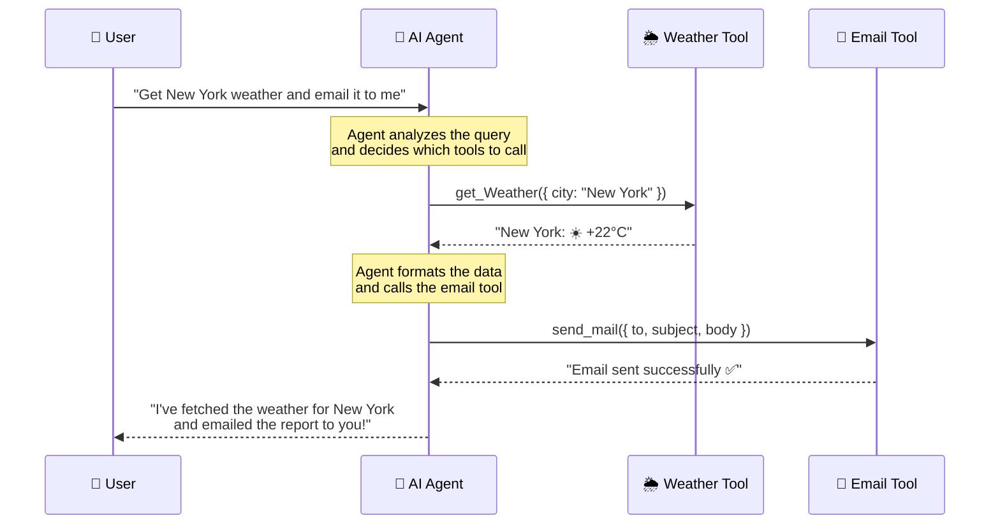
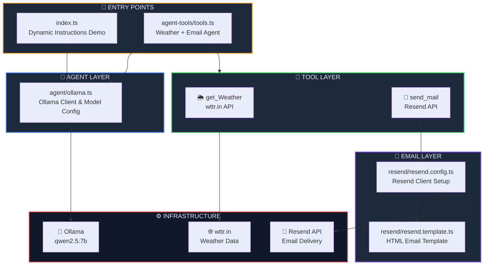
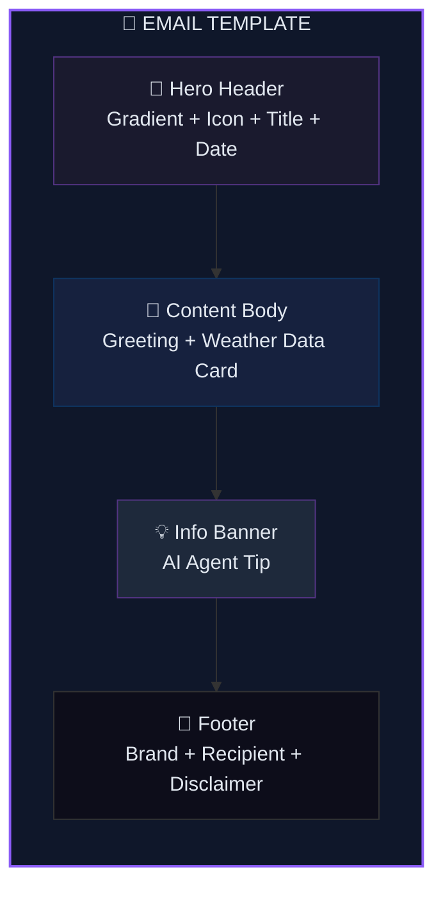

<p align="center">
  
  
  
  
  
  
</p>

<h1 align="center">🛠️ Tool Calling in AI Agents</h1>

<p align="center">
  <strong>Give your AI agent superpowers — let it call tools, fetch live data, and send emails autonomously.</strong><br/>
  Powered by <a href="https://github.com/openai/openai-agents-js">OpenAI Agents SDK</a>, <a href="https://ollama.com">Ollama</a> &amp; <a href="https://resend.com">Resend</a>.
</p>

<p align="center">
  <a href="#-quick-start">Quick Start</a> •
  <a href="#-what-is-tool-calling">What is Tool Calling?</a> •
  <a href="#-tools-in-this-project">Tools</a> •
  <a href="#%EF%B8%8F-architecture">Architecture</a> •
  <a href="#-email-template">Email Template</a> •
  <a href="#-advanced-usage">Advanced</a>
</p>

---

## 📖 Overview

This project demonstrates how to build an **AI agent with tool-calling capabilities** — the agent can autonomously decide to invoke external functions like fetching **real-time weather data** and **sending beautifully styled email reports**. All inference runs locally via **Ollama**, making it completely free and private.

### ✨ Key Highlights

| Feature | Description |
|---------|-------------|
| 🔧 **Tool Calling** | Agent autonomously decides when to invoke external functions |
| 🌦️ **Live Weather** | Fetches real-time weather via [wttr.in](https://wttr.in) API |
| 📧 **Email Reports** | Sends premium dark-themed weather reports via [Resend](https://resend.com) |
| 🧠 **Dynamic Instructions** | Context-aware system prompts that change based on user location |
| 🔒 **100% Local LLM** | All AI inference runs on your machine via Ollama |
| ✅ **Zod Validation** | Type-safe tool parameters with runtime schema validation |
| 📐 **Modular Architecture** | Clean separation of concerns across agent, tools & email layers |

---

## 🧠 What is Tool Calling?

**Tool calling** (also called *function calling*) allows an LLM to **decide on its own** which external functions to invoke based on the user's query. Instead of just generating text, the agent can take real actions in the world.

### How Tool Calling Works



### Tool Calling vs Regular Chat

| Aspect | Regular Chat Agent | Agent with Tools |
|--------|:-----------------:|:----------------:|
| Text generation | ✅ | ✅ |
| Access live data | ❌ | ✅ |
| Perform real actions | ❌ | ✅ |
| Multi-step reasoning | ❌ | ✅ |
| Interact with APIs | ❌ | ✅ |
| Send emails/notifications | ❌ | ✅ |

---

## 🔧 Tools in This Project

### 🌦️ `get_Weather` — Live Weather Fetcher

Fetches **real-time weather data** from the [wttr.in](https://wttr.in) API for any city in the world.

```typescript
const getWeatherAgent = tool({
    name: 'get_Weather',
    description: 'Returns the current weather information for the given city',
    parameters: z.object({
        city: z.string().describe("Enter city name")
    }),
    execute: async ({ city }) => {
        const url = `https://wttr.in/${encodeURIComponent(city)}?format=3`;
        const res = await axios.get(url);
        return `The current weather in ${city} is ${res.data}`;
    }
});
```

| Property | Value |
|----------|-------|
| **Name** | `get_Weather` |
| **API** | [wttr.in](https://wttr.in) (free, no key required) |
| **Input** | City name (string) |
| **Output** | Current weather with temperature & emoji |

---

### 📧 `send_mail` — Email Sender via Resend

Sends a **beautifully styled HTML email** with the weather report using the [Resend](https://resend.com) API.

```typescript
const sendEmailAgent = tool({
    name: 'send_mail',
    description: 'Send an email to the user with all the weather data',
    parameters: z.object({
        to: z.string().email(),
        subject: z.string(),
        body: z.string(),
    }),
    execute: async ({ to, subject, body }) => {
        await sendEmail(EMAIL_ADDRESS, subject, body);
        return `The email has been sent to ${EMAIL_ADDRESS}`;
    }
});
```

| Property | Value |
|----------|-------|
| **Name** | `send_mail` |
| **Service** | [Resend](https://resend.com) |
| **Input** | Recipient email, subject, body |
| **Output** | Confirmation of email delivery |
| **Template** | Premium dark-themed HTML (see [Email Template](#-email-template)) |

---

## 🏗️ Architecture



### 📂 Project Structure

```
02. Tool-Calling-in-Agent/
├── 🎯 index.ts                     # Entry — agent with dynamic instructions
├── 🤖 agent/
│   └── ollama.ts                   # Ollama client & model configuration
├── 🔧 agent-tools/
│   └── tools.ts                    # Tool definitions + agent runner
├── 📨 resend/
│   ├── resend.config.ts            # Resend client setup & sendEmail()
│   └── resend.template.ts          # Premium dark-themed HTML template
├── 🔒 .env                         # API keys & environment variables
├── 📦 package.json                 # Dependencies & project metadata
├── ⚙️ tsconfig.json                # TypeScript compiler configuration
├── 🔗 bun.lock                     # Bun lockfile
└── 📖 README.md                    # You are here
```

---

## ⚡ Quick Start

### Prerequisites

| Requirement | Minimum Version | Purpose |
|-------------|:--------------:|---------|
| [Bun](https://bun.sh) | v1.3+ | JavaScript/TypeScript runtime |
| [Ollama](https://ollama.com) | Latest | Local LLM inference |
| [Resend Account](https://resend.com) | Free tier | Email delivery service |

### Step 1 — Start Ollama & Pull the Model

```bash
# Start the Ollama server
ollama serve

# Pull the model used in this project
ollama pull qwen2.5:7b
```

### Step 2 — Install Dependencies

```bash
bun install
```

### Step 3 — Configure Environment Variables

Create a `.env` file in the project root:

```env
RESEND_API_KEY=re_your_resend_api_key_here
FROM_EMAIL=Your Name <onboarding@resend.dev>
EMAIL_ADDRESS=recipient@example.com
```

| Variable | Description |
|----------|-------------|
| `RESEND_API_KEY` | Your Resend API key ([get one here](https://resend.com/api-keys)) |
| `FROM_EMAIL` | Sender address (use Resend's sandbox or your verified domain) |
| `EMAIL_ADDRESS` | Recipient email for weather reports |

### Step 4 — Run the Agent

```bash
# Run the basic agent (dynamic instructions demo)
bun run index.ts

# Run the tool-calling agent (weather + email)
bun run agent-tools/tools.ts
```

### Expected Output

```
Tool Calling 🤖🤖🤖🤖🤖🤖🤖🤖🤖🤖🤖🤖🤖
result New York: ☀️ +22°C
function called for this city New York

Tool Calling 🤖🤖🤖🤖🤖🤖🤖🤖🤖🤖🤖🤖🤖
The email has been sent to your@email.com

✅ Weather report emailed successfully!
```

---

## 📧 Email Template

The project includes a **premium dark-themed HTML email template** that the agent uses to send weather reports.

### ✨ Template Features

| Feature | Implementation |
|---------|---------------|
| 🎨 **Gradient Header** | `linear-gradient(135deg, #1a1a2e → #533483)` |
| ⛅ **Dynamic Weather Icon** | 64px centered emoji icon |
| 📅 **Auto Date/Time** | Generated at send time with locale formatting |
| 🌑 **Glassmorphism Card** | Semi-transparent content area with subtle borders |
| 💡 **AI Tip Banner** | Purple-tinted info section |
| 🤖 **Branded Footer** | "Powered by OpenAI Agent SDK" with gradient divider |
| 📱 **Responsive Layout** | Table-based, works on all email clients |
| ✏️ **Auto Formatting** | Converts `\n` → `<br>`, `•` and `- ` → bullet points |

### Template Architecture



---

## 🔑 Key Concepts

### 1. Defining Tools with Zod Schemas

The `tool()` function from `@openai/agents` creates a callable tool. Zod validates the parameters at runtime:

```typescript
import { tool } from "@openai/agents";
import { z } from "zod";

const myTool = tool({
    name: "tool_name",
    description: "What this tool does",
    parameters: z.object({
        param1: z.string().describe("Parameter description"),
    }),
    execute: async ({ param1 }) => {
        // Your tool logic here
        return "result";
    },
});
```

### 2. Registering Multiple Tools

Pass an array of tools to the agent. The LLM decides which to call and in what order:

```typescript
const agent = new Agent({
    name: "Multi-Tool Agent",
    model: ollamaModel,
    instructions: "Use the tools to help the user...",
    tools: [getWeatherAgent, sendEmailAgent],  // Agent picks which to call
});
```

### 3. Dynamic System Instructions

System prompts can be async functions, enabling context-aware behavior:

```typescript
const agent = new Agent({
    model: ollamaModel,
    instructions: async function () {
        if (location === "india") {
            return "Response In Namaste in Indian Language...";
        }
        return "Response in English and in US Style";
    },
});
```

### 4. Modular Ollama Configuration

The Ollama client is abstracted into a reusable module:

```typescript
// agent/ollama.ts
import { OpenAIChatCompletionsModel } from "@openai/agents";
import OpenAI from "openai";

const ollamaClient = new OpenAI({
    baseURL: "http://localhost:11434/v1/",
    apiKey: "ollama",  // Required by SDK, ignored by Ollama
});

export const ollamaModel = new OpenAIChatCompletionsModel(
    ollamaClient,
    "qwen2.5:7b"
);
```

---

## 🔧 Advanced Usage

### Switch to OpenAI Cloud Models

Replace the Ollama model with OpenAI's hosted models in one line:

```typescript
// Before (local)
import { ollamaModel } from "../agent/ollama";
const agent = new Agent({ model: ollamaModel, ... });

// After (cloud)
const agent = new Agent({ model: "gpt-4o-mini", ... });
```

> **Note:** Set `OPENAI_API_KEY` in your `.env` and remove `setTracingDisabled(true)`.

### Add Custom Tools

Extend the agent with your own tools:

```typescript
const searchTool = tool({
    name: "web_search",
    description: "Search the web for information",
    parameters: z.object({
        query: z.string().describe("Search query"),
    }),
    execute: async ({ query }) => {
        // Your search logic
        return `Results for: ${query}`;
    },
});

// Add to agent
const agent = new Agent({
    tools: [getWeatherAgent, sendEmailAgent, searchTool],
    ...
});
```

### Multi-City Weather Query

The agent already supports multi-city queries out of the box:

```typescript
main(`Weather for New York, London, and Tokyo.
    Format as bullets with emojis.
    Email the full report to ${EMAIL_ADDRESS}.`);
```

---

## 📦 Dependencies

| Package | Version | Purpose |
|---------|---------|---------|
| `@openai/agents` | ^0.11.6 | OpenAI Agents SDK — agent framework with tool support |
| `openai` | ^6.39.1 | OpenAI client library (Ollama compatibility layer) |
| `axios` | ^1.16.1 | HTTP client for weather API requests |
| `resend` | ^6.12.4 | Resend SDK for email delivery |
| `dotenv` | ^17.4.2 | Load environment variables from `.env` file |
| `zod` | ^4.4.3 | Runtime schema validation for tool parameters |
| `@types/bun` | ^1.3.14 | TypeScript type definitions for Bun runtime |

---

## 🛠️ Troubleshooting

<details>
<summary><strong>❌ Ollama Connection Refused</strong></summary>

```
ECONNREFUSED 127.0.0.1:11434
```

**Cause:** Ollama server is not running.

**Fix:**
```bash
ollama serve
```
</details>

<details>
<summary><strong>❌ Model Not Found</strong></summary>

```
model "qwen2.5:7b" not found
```

**Cause:** The model hasn't been pulled yet.

**Fix:**
```bash
ollama pull qwen2.5:7b
```
</details>

<details>
<summary><strong>❌ Resend API Error</strong></summary>

```
Error: Please provide FROM_EMAIL and RESEND_API_KEY
```

**Cause:** Missing or incorrect environment variables.

**Fix:** Ensure your `.env` file has all three variables:
```env
RESEND_API_KEY=re_your_key_here
FROM_EMAIL=Your Name <onboarding@resend.dev>
EMAIL_ADDRESS=your@email.com
```
</details>

<details>
<summary><strong>❌ Tool Not Being Called</strong></summary>

**Cause:** The LLM may not support tool calling, or the model is too small.

**Fix:** Use a larger model with better tool-calling support:
```bash
ollama pull qwen2.5:7b    # Recommended
ollama pull llama3.2       # Alternative
```
</details>

---

## 🧩 Series Navigation

| # | Module | Topic | Status |
|---|--------|-------|--------|
| 01 | [First Agent Setup](../01.%20First-Agent-Setup/) | Basic agent creation with Ollama | ✅ Complete |
| 02 | **Tool Calling in Agent** *(you are here)* | Tools, weather API & email integration | ✅ Complete |
| 03 | [Structured Outputs with Zod](../03.%20StructuredAIOutputswithZod/) | Zod validation & structured AI responses | ✅ Complete |
| 04 | [Multi-Agent System](../04.%20Multi-agentSystem/) | Agent delegation & agent-as-tool | ✅ Complete |
| 05 | [Hands-off Multi-Agent](../05.%20Hands-off%20(MultiAgentSystem)/) | Handoffs, receptionist routing & autonomous pipeline | ✅ Complete |
| 06 | [Input Guardrails](../06.%20InputGuardrailsInAgents/) | Input validation, tripwires & safety patterns | ✅ Complete |

---

## 📜 License

This project is part of the **OpenAI Agent SDK Series** — built for learning and experimentation.

---

<p align="center">
  <sub>Built with ❤️ using OpenAI Agents SDK, Ollama &amp; Resend</sub><br/>
  <sub>Give your AI agent real-world superpowers. 🛠️</sub>
</p>
