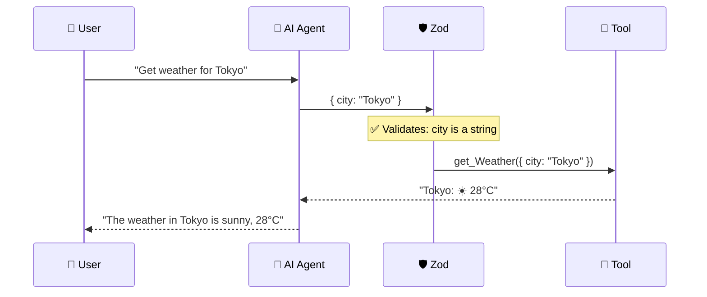
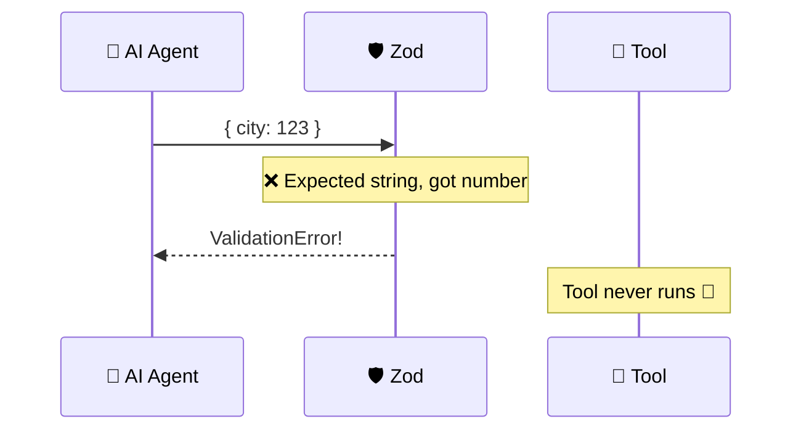

<p align="center">
  
  
  
  
</p>

<h1 align="center">🛡️ Structured AI Outputs with Zod</h1>

<p align="center">
  <strong>Why AI agents need Zod — and how runtime validation turns messy AI text into reliable, typed data.</strong><br/>
  Part 3 of the <a href="https://github.com/openai/openai-agents-js">OpenAI Agent SDK</a> Series.
</p>

<p align="center">
  <a href="#-why-we-need-zod">Why Zod?</a> •
  <a href="#-the-problem-without-zod">The Problem</a> •
  <a href="#-how-zod-works">How It Works</a> •
  <a href="#-quick-start">Quick Start</a> •
  <a href="#-zod-in-ai-agents">Zod in AI Agents</a>
</p>

---

## 🤔 Why We Need Zod

### The JavaScript Problem

JavaScript has **no runtime type checking**. TypeScript adds types, but they **vanish after compilation** — they exist only in your editor, not when your code actually runs.

```
TypeScript types → compile → JavaScript → types are GONE 💀
```

This means:
- An API can send `{ age: "twenty" }` instead of `{ age: 20 }` and your code won't complain
- An AI model can return `"Here's the weather: sunny"` instead of `{ weather: "sunny", temp: 22 }`
- Your app crashes **silently** at runtime with no helpful error

### What Zod Does

**Zod is a runtime validation library.** It checks your data _while the code runs_, not just in the editor.

```
Data comes in → Zod checks it → ✅ Valid (use it) or ❌ Invalid (throw error with details)
```

Think of Zod as a **security guard for your data** 💂 — it inspects every piece of data at the door and rejects anything that doesn't match the rules.

---

## 🔴 The Problem Without Zod

Imagine asking an AI agent: _"Tell me about Japan"_

**Without Zod** — the AI returns whatever it feels like:

```
Response 1: "Japan's capital is Tokyo with 125 million people..."
Response 2: "Capital: Tokyo\nPopulation: 125M\nLanguage: Japanese"
Response 3: "🇯🇵 Japan — a beautiful island nation in East Asia..."
```

Every response is **different**. How do you extract the capital? The population? You'd need fragile regex or string splitting that breaks constantly.

**With Zod** — you define the exact shape, and the AI **must** follow it:

```json
{
  "name": "Japan",
  "capital": "Tokyo",
  "population": "125 million",
  "languages": ["Japanese"]
}
```

Same shape. Every. Single. Time. ✅

---

## ⚙️ How Zod Works

### Step 1 — Define a Schema

A schema is a set of rules your data must follow:

```typescript
import { z } from "zod";

const UserSchema = z.object({
    name: z.string().min(2, "Name must be at least 2 characters"),
    age: z.number().min(18, "Must be 18 or older"),
    email: z.string().email("Invalid email format"),
    role: z.enum(["admin", "user", "editor"]),
});
```

### Step 2 — Validate Data with `safeParse`

```typescript
// ✅ Good data — passes
const good = { name: "Sanidhya", age: 25, email: "s@example.com", role: "admin" };
const result = UserSchema.safeParse(good);
// result.success → true
// result.data → { name: "Sanidhya", age: 25, ... }

// ❌ Bad data — Zod catches every mistake
const bad = { name: "S", age: 15, email: "not-email", role: "hacker" };
const result2 = UserSchema.safeParse(bad);
// result2.success → false
// result2.error.issues → [
//   { path: ["name"],  message: "Name must be at least 2 characters" },
//   { path: ["age"],   message: "Must be 18 or older" },
//   { path: ["email"], message: "Invalid email format" },
//   { path: ["role"],  message: "Invalid enum value..." }
// ]
```

### Step 3 — Infer TypeScript Types (Zero Duplication)

```typescript
type User = z.infer<typeof UserSchema>;

// TypeScript now knows:
// type User = {
//   name: string;
//   age: number;
//   email: string;
//   role: "admin" | "user" | "editor";
// }
```

**One schema → runtime validation + TypeScript type.** No writing the same thing twice.

### Common Zod Methods

| Method | What It Does | Example |
|--------|-------------|---------|
| `z.string()` | Validates strings | `z.string().min(2)` |
| `z.number()` | Validates numbers | `z.number().min(0).max(100)` |
| `z.boolean()` | Validates booleans | `z.boolean()` |
| `z.enum()` | Only allows listed values | `z.enum(["a", "b", "c"])` |
| `z.array()` | Validates arrays | `z.array(z.string())` |
| `z.object()` | Validates objects | `z.object({ key: z.string() })` |
| `z.optional()` | Field can be undefined | `z.string().optional()` |
| `.describe()` | Adds description (for AI) | `z.string().describe("User's name")` |
| `.safeParse()` | Validates without throwing | Returns `{ success, data/error }` |
| `.parse()` | Validates and throws on error | Throws `ZodError` if invalid |

---

## ⚡ Quick Start

### Prerequisites

| Requirement | Minimum Version | Purpose |
|-------------|:--------------:|---------:|
| [Bun](https://bun.sh) | v1.3+ | JavaScript/TypeScript runtime |

### Step 1 — Initialize the Project

```bash
bun init -y
```

> This creates `package.json`, `tsconfig.json`, and `index.ts` automatically.
> The `-y` flag skips all prompts and uses defaults.

### Step 2 — Install Zod

```bash
bun add zod
```

### Step 3 — Run the Example

```bash
bun run index.ts
```

### Expected Output

```
✅ Valid: {
  name: "Sanidhya",
  age: 25,
  email: "sanidhya@example.com",
  role: "admin"
}

❌ Validation Errors:
   → name: Name must be at least 2 characters
   → age: Must be 18 or older
   → email: Invalid email format
   → role: Invalid enum value. Expected 'admin' | 'user' | 'editor', received 'hacker'
```

---

## 🤖 Zod in AI Agents

### Why AI Agents Need Zod

When you give a `tool` to an AI agent (like in [Project 02](../02.%20Tool-Calling-in-Agent/)), the agent decides **what arguments** to pass to that tool. But the AI can make mistakes — wrong types, missing fields, invalid values.

Zod solves this by validating tool parameters **before** the tool runs:



If the AI sends bad data, Zod catches it **before** the tool executes:



### How Tools Use Zod — From Project 02

In [Project 02](../02.%20Tool-Calling-in-Agent/), every tool uses Zod for its `parameters`:

```typescript
import { tool } from "@openai/agents";
import { z } from "zod";

const getWeatherAgent = tool({
    name: "get_Weather",
    description: "Returns current weather for a city",
    parameters: z.object({
        city: z.string().describe("Enter city name"),  // 👈 Zod validates this
    }),
    execute: async ({ city }) => {
        // This ONLY runs if Zod validation passes
        // `city` is guaranteed to be a string here
        return `Weather in ${city}: ☀️ 28°C`;
    },
});
```

### Structured Output with `outputType`

You can also force the **entire agent response** into a Zod schema using `outputType`:

```typescript
const CountrySchema = z.object({
    name: z.string().describe("Country name"),
    capital: z.string().describe("Capital city"),
    population: z.string().describe("Population count"),
});

const agent = new Agent({
    model: ollamaModel,
    name: "Geography Agent",
    instructions: "Return accurate country data as JSON.",
    outputType: CountrySchema,  // 👈 Forces structured JSON output
});

const result = await run(agent, "Tell me about India");
// result.finalOutput → { name: "India", capital: "New Delhi", population: "1.4 billion" }
// It's a typed object, NOT a string! 🎯
```

---

## 🔑 Zod vs No Zod — Side by Side

| Aspect | Without Zod | With Zod |
|--------|:-----------:|:--------:|
| Runtime type safety | ❌ | ✅ |
| AI output validation | ❌ | ✅ |
| Tool parameter checking | ❌ | ✅ |
| Helpful error messages | ❌ | ✅ |
| TypeScript type inference | ❌ | ✅ |
| Data always same shape | ❌ | ✅ |
| App crashes from bad data | 💀 Yes | 🛡️ No |

---

## 📂 Project Structure

```
03. StructuredAIOutputswithZod/
├── 🎯 index.ts              # Zod validation examples (valid + invalid data)
├── 🤖 agent/
│   └── ollama.ts            # Ollama client & model configuration
├── 🔒 .env                   # Environment variables (optional)
├── 📦 package.json           # Dependencies & project metadata
├── ⚙️ tsconfig.json          # TypeScript compiler configuration
└── 📖 README.md              # You are here
```

---

## 📦 Dependencies

| Package | Version | Purpose |
|---------|---------|---------|
| `zod` | ^4.4.3 | Runtime schema validation — the star of this project |
| `@openai/agents` | ^0.11.6 | OpenAI Agents SDK (uses Zod for tool params & output) |
| `openai` | ^6.39.1 | OpenAI client library (Ollama compatibility) |
| `dotenv` | ^17.4.2 | Load environment variables from `.env` file |
| `@types/bun` | ^1.3.14 | TypeScript types for Bun runtime |

---

## 🧩 Series Navigation

| # | Module | Topic | Status |
|---|--------|-------|--------|
| 01 | [First Agent Setup](../01.%20First-Agent-Setup/) | Basic agent creation with Ollama | ✅ Complete |
| 02 | [Tool Calling in Agent](../02.%20Tool-Calling-in-Agent/) | Tools, weather API & email integration | ✅ Complete |
| 03 | **Structured Outputs with Zod** *(you are here)* | Zod validation & structured AI responses | ✅ Complete |
| 04 | [Multi-Agent System](../04.%20Multi-agentSystem/) | Agent delegation & agent-as-tool | ✅ Complete |
| 05 | [Hands-off Multi-Agent](../05.%20Hands-off%20(MultiAgentSystem)/) | Handoffs, receptionist routing & autonomous pipeline | ✅ Complete |
| 06 | [Input Guardrails](../06.%20InputGuardrailsInAgents/) | Input validation, tripwires & safety patterns | ✅ Complete |

---

## 📜 License

This project is part of the **OpenAI Agent SDK Series** — built for learning and experimentation.

---

<p align="center">
  <sub>Built with ❤️ using Zod & OpenAI Agents SDK</sub><br/>
  <sub>Validate everything. Trust nothing. 🛡️</sub>
</p>
