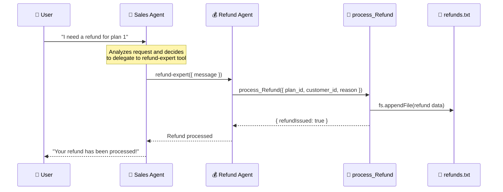
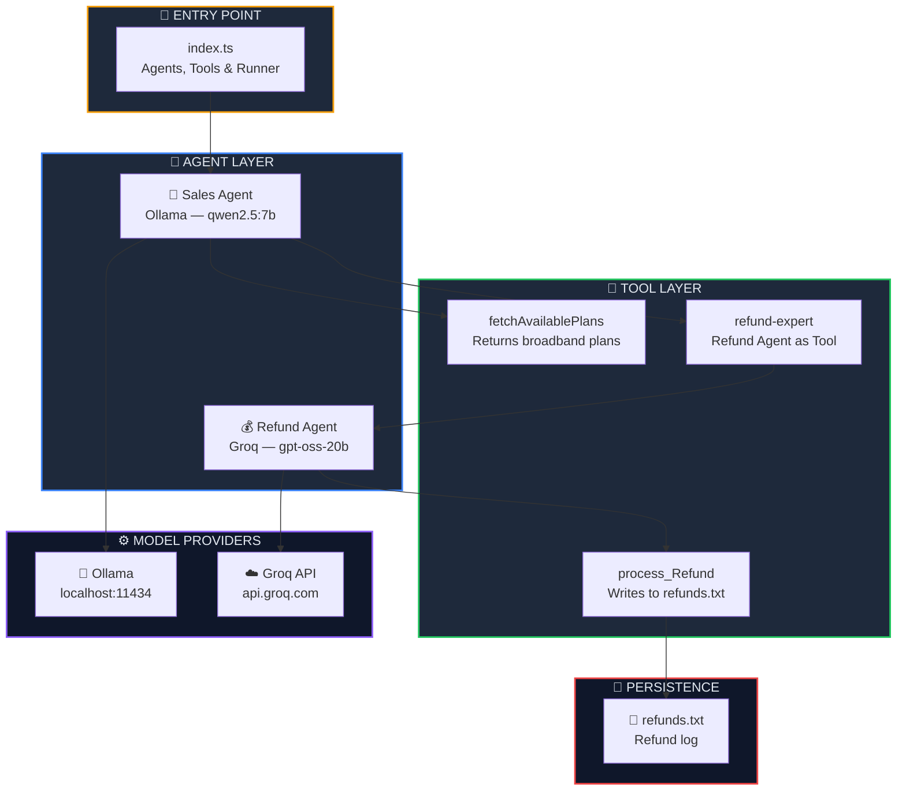

<p align="center">
  
  
  
  
  
  
</p>

<h1 align="center">🔀 Multi-Agent System</h1>

<p align="center">
  <strong>Build a multi-agent architecture where a Sales Agent delegates refund processing to a specialized Refund Agent — powered by dual LLM providers.</strong><br/>
  Part 4 of the <a href="https://github.com/openai/openai-agents-js">OpenAI Agent SDK</a> Series.
</p>

<p align="center">
  <a href="#-quick-start">Quick Start</a> •
  <a href="#-what-is-a-multi-agent-system">What is Multi-Agent?</a> •
  <a href="#%EF%B8%8F-architecture">Architecture</a> •
  <a href="#-key-concepts">Key Concepts</a> •
  <a href="#-troubleshooting">Troubleshooting</a>
</p>

---

## 📖 Overview

This project demonstrates a **multi-agent system** where a **Sales Agent** (running on local Ollama) handles broadband plan queries and delegates refund processing to a **Refund Agent** (running on cloud Groq). The Refund Agent is embedded as a tool using `agent.asTool()`, enabling seamless inter-agent delegation with file I/O persistence.

### ✨ Key Highlights

| Feature | Description |
|---------|-------------|
| 🔀 **Agent-as-Tool** | Refund Agent is converted into a callable tool via `agent.asTool()` |
| 🦙+☁️ **Dual Model Providers** | Sales Agent → Ollama (local), Refund Agent → Groq (cloud) |
| 🛠️ **Tool Calling** | Agents invoke tools (`fetchAvailablePlans`, `process_Refund`) autonomously |
| 📄 **File I/O** | Refund data is persisted to `refunds.txt` via `fs.appendFile` |
| ✅ **Zod Validation** | Type-safe tool parameters with runtime schema validation |
| 📐 **Modular Architecture** | Separate model configs for Ollama & Groq |

---

## 🧠 What is a Multi-Agent System?

A **multi-agent system** is an architecture where multiple specialized AI agents work together, each handling a specific domain. Instead of one monolithic agent, you split responsibilities across focused agents that can delegate tasks to each other.

### Single Agent vs Multi-Agent

| Aspect | Single Agent | Multi-Agent |
|--------|:-----------:|:-----------:|
| Handles all domains | ✅ (poorly) | ❌ (specialized) |
| Domain expertise | ❌ | ✅ |
| Delegates tasks | ❌ | ✅ |
| Uses multiple models | ❌ | ✅ |
| Scalable complexity | ❌ | ✅ |
| Agent-as-Tool | ❌ | ✅ |

### How the Multi-Agent Pipeline Works



---

## 🏗️ Architecture



### 📂 Project Structure

```
04. Multi-agentSystem/
├── 🎯 index.ts              # Main entry — agents, tools & runner
├── 🤖 agent/
│   ├── ollama.ts            # Ollama client & model config (qwen2.5:7b)
│   └── groq.ts              # Groq client & model config (gpt-oss-20b)
├── 📄 refunds.txt            # Auto-generated refund log (created at runtime)
├── 🔒 .env                   # Environment variables (GROQ_API_KEY)
├── 📦 package.json           # Dependencies & project metadata
├── ⚙️ tsconfig.json          # TypeScript compiler configuration
├── 🔗 bun.lock               # Bun lockfile
└── 📖 README.md              # You are here
```

---

## 🔑 Key Concepts

### 1. Agent-as-Tool — `agent.asTool()`

The core concept of this chapter. `asTool()` converts an entire agent into a tool that another agent can call — enabling agent-to-agent delegation:

```typescript
const salesAgent = new Agent({
    tools: [
        fetchAvailablePlans,
        refundAgent.asTool({
            toolName: 'refund-expert',
            toolDescription: 'Use this tool when a user asks for a refund.'
        })
    ],
});
```

| Aspect | Regular Tool | Agent-as-Tool |
|--------|:-----------:|:------------:|
| Defined via | `tool()` | `agent.asTool()` |
| Logic | Custom function | Full agent pipeline |
| Has its own LLM | ❌ | ✅ |
| Multi-step reasoning | ❌ | ✅ |
| Can call its own tools | ❌ | ✅ |

### 2. Dual Model Providers

This project uses **two different LLM providers** — demonstrating that agents in the same system can run on different models:

```typescript
// Sales Agent → Local Ollama (free, private)
const salesAgent = new Agent({
    model: ollamaModel,  // qwen2.5:7b on localhost
    ...
});

// Refund Agent → Cloud Groq (fast, capable)
const refundAgent = new Agent({
    model: groqModel,    // gpt-oss-20b on Groq
    ...
});
```

### 3. Tools with File I/O

The `process_Refund` tool demonstrates tools that have **side effects** — writing data to the filesystem:

```typescript
const processRefund = tool({
    name: 'process_Refund',
    parameters: z.object({
        plan_id: z.string(),
        customer_id: z.string(),
        reason: z.string().describe('Reason for refund'),
    }),
    execute: async ({ plan_id, customer_id, reason }) => {
        const data = JSON.stringify({ plan_id, customer_id, reason });
        await fs.appendFile("./refunds.txt", data + "\n", "utf-8");
        return { refundIssued: true, customer_id, plan_id, reason };
    }
});
```

Each run appends a JSON line to `refunds.txt`:
```json
{"plan_id":"1","customer_id":"cust123","reason":"shifting to a new place"}
```

### 4. Forceful Agent Instructions

Both agents use **forceful instructions** to prevent the LLM from asking follow-up questions instead of acting:

```typescript
const refundAgent = new Agent({
    instructions: `You are a refund processing agent. When you receive a refund 
    request, you MUST immediately call the process_Refund tool. 
    Do NOT ask follow-up questions. Just process the refund.`,
});
```

> **💡 Tip:** Without "MUST" and "Do NOT ask follow-up questions", many models will ask clarifying questions instead of calling the tool — defeating the purpose of automation.

---

## ⚡ Quick Start

### Prerequisites

| Requirement | Minimum Version | Purpose |
|-------------|:--------------:|---------:|
| [Bun](https://bun.sh) | v1.3+ | JavaScript/TypeScript runtime |
| [Ollama](https://ollama.com) | Latest | Local LLM inference (Sales Agent) |
| [Groq Account](https://console.groq.com) | Free tier | Cloud LLM inference (Refund Agent) |

### Step 1 — Start Ollama & Pull the Model

```bash
ollama serve
ollama pull qwen2.5:7b
```

### Step 2 — Install Dependencies

```bash
cd "04. Multi-agentSystem"
bun install
```

### Step 3 — Configure Environment Variables

Create a `.env` file:

```env
GROQ_API_KEY=gsk_your_groq_api_key_here
```

| Variable | Description |
|----------|-------------|
| `GROQ_API_KEY` | Your Groq API key ([get one here](https://console.groq.com/keys)) |

### Step 4 — Run the Agent

```bash
bun run index.ts
```

### Expected Output

```
Tool Calling 🤖🤖🤖🤖🤖🤖🤖🤖🤖🤖🤖🤖🤖
Tool Calling 🤖🤖🤖🤖🤖🤖🤖🤖🤖🤖🤖🤖🤖
Your refund has been processed successfully!
```

A `refunds.txt` file will be created/appended with:
```json
{"plan_id":"1","customer_id":"cust123","reason":"shifting to a new place"}
```

---

## 📦 Dependencies

| Package | Version | Purpose |
|---------|---------|---------| 
| `@openai/agents` | ^0.11.6 | OpenAI Agents SDK — agent framework with `asTool()` |
| `openai` | ^6.42.0 | OpenAI client library (Ollama & Groq compatibility) |
| `zod` | ^4.4.3 | Runtime schema validation for tool parameters |
| `dotenv` | ^17.4.2 | Load environment variables from `.env` file |
| `groq-sdk` | ^1.2.1 | Groq cloud LLM provider |
| `axios` | ^1.17.0 | HTTP client (inherited dependency) |
| `resend` | ^6.12.4 | Email service (inherited dependency) |
| `@types/bun` | latest | TypeScript type definitions for Bun runtime |

---

## 🛠️ Troubleshooting

<details>
<summary><strong>❌ Ollama Connection Refused</strong></summary>

```
ECONNREFUSED 127.0.0.1:11434
```

**Cause:** Ollama server is not running.

**Fix:**
```bash
ollama serve
```
</details>

<details>
<summary><strong>❌ Agent Not Calling Tools (Text Response Only)</strong></summary>

```
The refund request has been forwarded to the refund agent...
```

**Cause:** The model is generating a text response instead of invoking the tool. Common with smaller or weaker models.

**Fix:** Use a model with reliable tool-calling support:
```typescript
// ✅ Reliable for tool calling
const ollamaModel = new OpenAIChatCompletionsModel(ollamaClient, 'qwen2.5:7b');
```
</details>

<details>
<summary><strong>❌ Groq API Key Error</strong></summary>

```
Error: Invalid API key
```

**Cause:** Missing or incorrect `GROQ_API_KEY` in `.env`.

**Fix:** Ensure your `.env` file has a valid key:
```env
GROQ_API_KEY=gsk_your_key_here
```

Get a key at [console.groq.com/keys](https://console.groq.com/keys).
</details>

<details>
<summary><strong>❌ refunds.txt Not Being Created</strong></summary>

**Cause:** The `process_Refund` tool is never being called — the agent is responding with text instead of invoking the tool.

**Fix:** Check the console for `Tool Calling 🤖🤖🤖...` logs. If missing:
1. Verify you're using `qwen2.5:7b` (not a smaller model)
2. Make the agent instructions more forceful with "MUST" and "Do NOT ask"
</details>

---

## 🧩 Series Navigation

| # | Module | Topic | Status |
|---|--------|-------|--------|
| 01 | [First Agent Setup](../01.%20First-Agent-Setup/) | Basic agent creation with Ollama | ✅ Complete |
| 02 | [Tool Calling in Agent](../02.%20Tool-Calling-in-Agent/) | Tools, weather API & email integration | ✅ Complete |
| 03 | [Structured Outputs with Zod](../03.%20StructuredAIOutputswithZod/) | Zod validation & structured AI responses | ✅ Complete |
| 04 | **Multi-Agent System** *(you are here)* | Agent delegation & agent-as-tool | ✅ Complete |
| 05 | [Hands-off Multi-Agent](../05.%20Hands-off%20(MultiAgentSystem)/) | Handoffs, receptionist routing & autonomous pipeline | ✅ Complete |
| 06 | [Input Guardrails](../06.%20InputGuardrailsInAgents/) | Input validation, tripwires & safety patterns | ✅ Complete |

---

## 📜 License

This project is part of the **OpenAI Agent SDK Series** — built for learning and experimentation.

---

<p align="center">
  <sub>Built with ❤️ using OpenAI Agents SDK, Ollama & Groq</sub><br/>
  <sub>One agent is good. Two agents are better. 🔀</sub>
</p>
