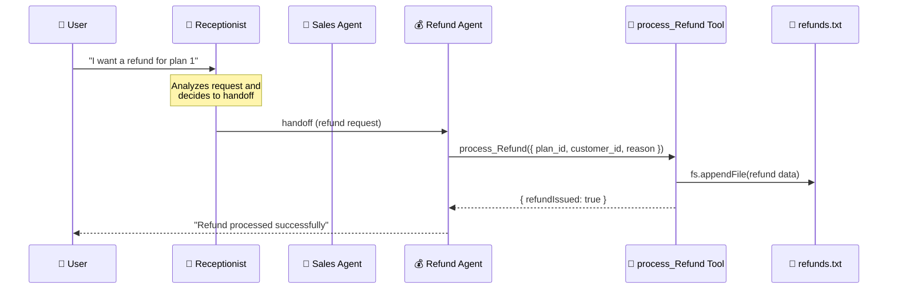
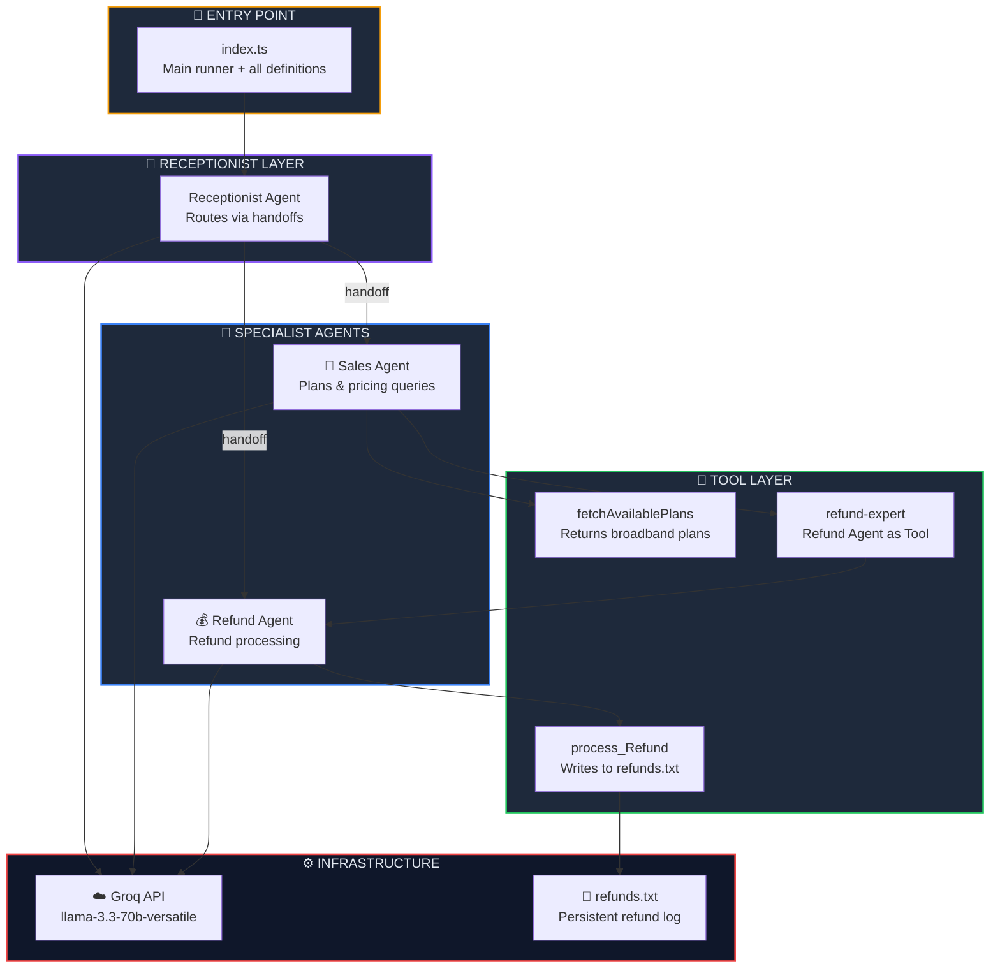

<p align="center">
  
  
  
  
  
</p>

<h1 align="center">🔄 Hands-off Multi-Agent System</h1>

<p align="center">
  <strong>Build a fully autonomous multi-agent pipeline — a receptionist routes requests to specialized agents who act without human intervention.</strong><br/>
  Part 5 of the <a href="https://github.com/openai/openai-agents-js">OpenAI Agent SDK</a> Series.
</p>

<p align="center">
  <a href="#-quick-start">Quick Start</a> •
  <a href="#-what-is-a-hands-off-multi-agent-system">What is Hands-off?</a> •
  <a href="#%EF%B8%8F-architecture">Architecture</a> •
  <a href="#-key-concepts">Key Concepts</a> •
  <a href="#-troubleshooting">Troubleshooting</a>
</p>

---

## 📖 Overview

This project demonstrates a **hands-off multi-agent system** where a **Receptionist Agent** triages incoming user requests and delegates them to the right specialist — either a **Sales Agent** (for plan inquiries) or a **Refund Agent** (for refund processing). The entire pipeline runs autonomously using **handoffs**, **agent-as-tool**, and **tool calling** — no human in the loop.

### ✨ Key Highlights

| Feature | Description |
|---------|-------------|
| 🔄 **Handoffs** | Receptionist auto-routes requests to the correct specialist agent |
| 🤖 **Agent-as-Tool** | Refund Agent is embedded as a tool inside the Sales Agent |
| 🛠️ **Tool Calling** | Agents invoke tools (fetch plans, process refunds) autonomously |
| 📄 **File I/O** | Refund data is persisted to `refunds.txt` via `fs.appendFile` |
| ☁️ **Groq Cloud LLM** | All agents powered by `llama-3.3-70b-versatile` on Groq |
| 🛡️ **RECOMMENDED_PROMPT_PREFIX** | Uses SDK's built-in prompt prefix for reliable handoff behavior |
| ✅ **Zod Validation** | Type-safe tool parameters with runtime schema validation |

---

## 🧠 What is a Hands-off Multi-Agent System?

In a **hands-off** architecture, the user sends a single request and the system handles everything autonomously — routing, delegation, tool execution, and response generation. No follow-up questions, no human approval steps.

### Hands-off vs Interactive Multi-Agent

| Aspect | Interactive (Ch. 04) | Hands-off (Ch. 05) |
|--------|:-------------------:|:------------------:|
| User sends request | ✅ | ✅ |
| Agent asks follow-ups | ✅ | ❌ |
| Routing is automatic | ❌ | ✅ |
| Uses `handoffs` | ❌ | ✅ |
| Uses `agent.asTool()` | ✅ | ✅ |
| Receptionist layer | ❌ | ✅ |
| Fully autonomous | ❌ | ✅ |

### How the Hands-off Pipeline Works



---

## 🏗️ Architecture



### 📂 Project Structure

```
05. Hands-off (MultiAgentSystem)/
├── 🎯 index.ts              # Main entry — all agents, tools & runner
├── 🤖 agent/
│   └── groq.ts              # Groq client & model configuration
├── 📄 refunds.txt            # Auto-generated refund log (created at runtime)
├── 🔒 .env                   # Environment variables (GROQ_API_KEY)
├── 📦 package.json           # Dependencies & project metadata
├── ⚙️ tsconfig.json          # TypeScript compiler configuration
├── 🔗 bun.lock               # Bun lockfile
└── 📖 README.md              # You are here
```

---

## 🔑 Key Concepts

### 1. Handoffs — Agent-to-Agent Routing

The `handoffs` property lets an agent **transfer control** to another agent entirely. Unlike `asTool()`, a handoff replaces the current agent — the receiving agent takes over the conversation.

```typescript
const recepetionAgent = new Agent({
    name: 'Receptionist',
    model: groqModel,
    instructions: `You have two agents available:
      - salesAgent: Expert in handling plan and pricing queries.
      - refundAgent: Expert in handling refund requests.
      Use your judgement to decide which agent to handoff to.`,
    handoffs: [salesAgent, refundAgent],  // 👈 Agent can transfer to either
});
```

| Concept | `handoffs` | `asTool()` |
|---------|:----------:|:----------:|
| Control transfer | Full handoff — agent takes over | Sub-call — returns result |
| Conversation owner | Receiving agent | Calling agent |
| Use case | Routing/triage | Delegation for a specific task |
| Response comes from | The target agent | The calling agent |

### 2. RECOMMENDED_PROMPT_PREFIX — Reliable Handoffs

The SDK provides a built-in prompt prefix that improves handoff reliability with non-OpenAI models:

```typescript
import { RECOMMENDED_PROMPT_PREFIX } from "@openai/agents-core/extensions"

const agent = new Agent({
    instructions: `
    ${RECOMMENDED_PROMPT_PREFIX}
    Your custom instructions here...
    `,
});
```

> **Why?** Non-OpenAI models (like Groq's Llama) may not natively understand handoff tool schemas. The `RECOMMENDED_PROMPT_PREFIX` adds system-level guidance that teaches the model how to properly invoke `transfer_to_*` tools.

### 3. Agent-as-Tool — Nested Agent Delegation

The Sales Agent embeds the Refund Agent as a **tool**, enabling a second delegation path:

```typescript
const salesAgent = new Agent({
    tools: [
        fetchAvailablePlans,
        refundAgent.asTool({
            toolName: 'refund-expert',
            toolDescription: 'Use this tool when a user asks for a refund.'
        })
    ],
});
```

This creates **two paths** to the Refund Agent:
1. **Receptionist → Refund Agent** (direct handoff)
2. **Receptionist → Sales Agent → Refund Agent** (nested via `asTool()`)

### 4. Tool with File I/O — Persisting Data

The `process_Refund` tool writes refund records to a local file:

```typescript
const processRefund = tool({
    name: 'process_Refund',
    parameters: z.object({
        plan_id: z.string(),
        customer_id: z.string(),
        reason: z.string().describe('Reason for refund'),
    }),
    execute: async ({ plan_id, customer_id, reason }) => {
        const data = JSON.stringify({ plan_id, customer_id, reason });
        await fs.appendFile("./refunds.txt", data + "\n", "utf-8");
        return { refundIssued: true, customer_id, plan_id, reason };
    }
});
```

Each run appends a JSON line to `refunds.txt`:
```json
{"plan_id":"1","customer_id":"cust100","reason":"shifting to a new place"}
```

### 5. Single Model for All Agents

Unlike [Chapter 04](../04.%20Multi-agentSystem/) which used Ollama + Groq, this project uses **Groq for all agents** — simpler setup, consistent behavior:

```typescript
// agent/groq.ts
import { OpenAIChatCompletionsModel } from '@openai/agents';
import OpenAI from "openai";

const client = new OpenAI({
    apiKey: process.env.GROQ_API_KEY,
    baseURL: "https://api.groq.com/openai/v1",
});

export const groqModel = new OpenAIChatCompletionsModel(
    client,
    'llama-3.3-70b-versatile'  // Reliable tool-calling model
);
```

> **💡 Tip:** `llama-3.3-70b-versatile` is recommended over smaller models for tool calling reliability. Smaller models may skip tool calls and return text responses instead.

---

## ⚡ Quick Start

### Prerequisites

| Requirement | Minimum Version | Purpose |
|-------------|:--------------:|---------:|
| [Bun](https://bun.sh) | v1.3+ | JavaScript/TypeScript runtime |
| [Groq Account](https://console.groq.com) | Free tier | Cloud LLM inference |

### Step 1 — Install Dependencies

```bash
cd "05. Hands-off (MultiAgentSystem)"
bun install
```

### Step 2 — Configure Environment Variables

Create a `.env` file in the project root:

```env
GROQ_API_KEY=gsk_your_groq_api_key_here
```

| Variable | Description |
|----------|-------------|
| `GROQ_API_KEY` | Your Groq API key ([get one here](https://console.groq.com/keys)) |

### Step 3 — Run the Agent

```bash
bun run index.ts
```

### Expected Output

```
Tool Calling 🤖🤖🤖🤖🤖🤖🤖🤖🤖🤖🤖🤖🤖
Refund processed successfully.
```

A `refunds.txt` file will be created with the refund record:
```json
{"plan_id":"1","customer_id":"cust100","reason":"shifting to a new place"}
```

---

## 📦 Dependencies

| Package | Version | Purpose |
|---------|---------|---------|
| `@openai/agents` | ^0.11.6 | OpenAI Agents SDK — agent framework with handoffs & tools |
| `openai` | ^6.42.0 | OpenAI client library (Groq compatibility layer) |
| `zod` | ^4.4.3 | Runtime schema validation for tool parameters |
| `dotenv` | ^17.4.2 | Load environment variables from `.env` file |
| `groq-sdk` | ^1.2.1 | Groq cloud LLM provider |
| `axios` | ^1.17.0 | HTTP client (inherited dependency) |
| `resend` | ^6.12.4 | Email service (inherited dependency) |
| `@types/bun` | latest | TypeScript type definitions for Bun runtime |

---

## 🛠️ Troubleshooting

<details>
<summary><strong>❌ Tool Call Validation Failed (400 Error)</strong></summary>

```
BadRequestError: 400 tool call validation failed: parameters for tool transfer_to_refund_agent did not...
```

**Cause:** The model is sending invalid parameters to the handoff tool (e.g., passing structured data instead of a string).

**Fix:** Add `RECOMMENDED_PROMPT_PREFIX` to the receptionist agent's instructions:
```typescript
import { RECOMMENDED_PROMPT_PREFIX } from "@openai/agents-core/extensions"

const agent = new Agent({
    instructions: `${RECOMMENDED_PROMPT_PREFIX}\nYour instructions...`,
});
```
</details>

<details>
<summary><strong>❌ Agent Not Calling Tools (Text Response Only)</strong></summary>

```
The refund request has been forwarded to the refund agent...
```

**Cause:** The model is generating a text response instead of invoking the tool. Common with smaller or weaker models.

**Fix:** Switch to a model with reliable tool-calling support:
```typescript
// ❌ Unreliable for tool calling
export const groqModel = new OpenAIChatCompletionsModel(client, 'openai/gpt-oss-20b');

// ✅ Reliable tool calling
export const groqModel = new OpenAIChatCompletionsModel(client, 'llama-3.3-70b-versatile');
```
</details>

<details>
<summary><strong>❌ refunds.txt Not Being Created</strong></summary>

**Cause:** The `process_Refund` tool is never being called — the agent is responding with text instead of invoking the tool.

**Fix:** Check the console for `Tool Calling 🤖🤖🤖...` log. If it's missing:
1. Verify you're using `llama-3.3-70b-versatile` (not a smaller model)
2. Add `RECOMMENDED_PROMPT_PREFIX` to the receptionist
3. Make the refund agent's instructions more forceful
</details>

<details>
<summary><strong>❌ Groq API Key Error</strong></summary>

```
Error: Invalid API key
```

**Cause:** Missing or incorrect `GROQ_API_KEY` in `.env`.

**Fix:** Ensure your `.env` file has a valid key:
```env
GROQ_API_KEY=gsk_your_key_here
```

Get a key at [console.groq.com/keys](https://console.groq.com/keys).
</details>

---

## 🧩 Series Navigation

| # | Module | Topic | Status |
|---|--------|-------|--------|
| 01 | [First Agent Setup](../01.%20First-Agent-Setup/) | Basic agent creation with Ollama | ✅ Complete |
| 02 | [Tool Calling in Agent](../02.%20Tool-Calling-in-Agent/) | Tools, weather API & email integration | ✅ Complete |
| 03 | [Structured Outputs with Zod](../03.%20StructuredAIOutputswithZod/) | Zod validation & structured AI responses | ✅ Complete |
| 04 | [Multi-Agent System](../04.%20Multi-agentSystem/) | Agent delegation & agent-as-tool | ✅ Complete |
| 05 | **Hands-off Multi-Agent** *(you are here)* | Handoffs, receptionist routing & autonomous pipeline | ✅ Complete |

---

## 📜 License

This project is part of the **OpenAI Agent SDK Series** — built for learning and experimentation.

---

<p align="center">
  <sub>Built with ❤️ using OpenAI Agents SDK & Groq</sub><br/>
  <sub>Let your agents handle it — hands off. 🔄</sub>
</p>
