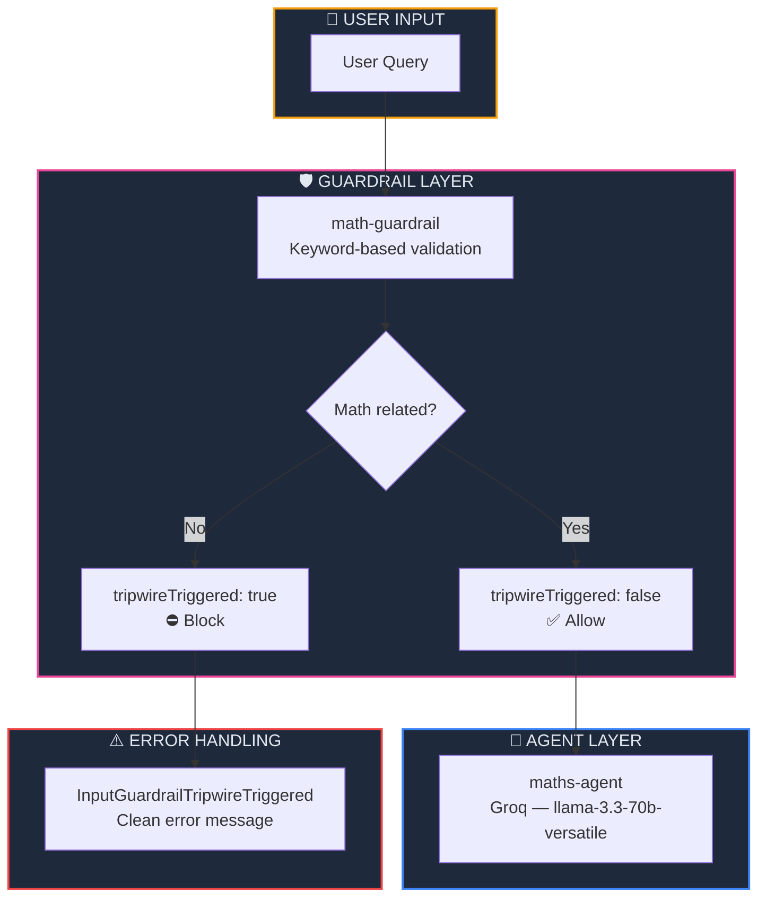

<p align="center">
  
  
  
  
  
</p>

<h1 align="center">🛡️ Input Guardrails in Agents</h1>

<p align="center">
  <strong>Protect your AI agents from off-topic, harmful, or invalid inputs — block bad requests before the LLM even processes them.</strong><br/>
  Part 6 of the <a href="https://github.com/openai/openai-agents-js">OpenAI Agent SDK</a> Series.
</p>

<p align="center">
  <a href="#-quick-start">Quick Start</a> •
  <a href="#-what-are-input-guardrails">What are Guardrails?</a> •
  <a href="#%EF%B8%8F-architecture">Architecture</a> •
  <a href="#-key-concepts">Key Concepts</a> •
  <a href="#-troubleshooting">Troubleshooting</a>
</p>

---

## 📖 Overview

This project demonstrates **Input Guardrails** — a safety mechanism that validates user input *before* the agent processes it. A math-only agent rejects any non-mathematical queries (like "Give me a While Loop example") by triggering a **tripwire** that halts execution and returns a clean error message.

### ✨ Key Highlights

| Feature | Description |
|---------|-------------|
| 🛡️ **Input Guardrails** | Validate user input before the agent even runs |
| ⛔ **Tripwire Pattern** | Halt execution when invalid input is detected |
| 🔑 **Keyword Matching** | Extensible math keyword list for domain validation |
| 🧱 **Error Handling** | `try-catch` with `InputGuardrailTripwireTriggered` for clean UX |
| ☁️ **Groq Cloud LLM** | Powered by `llama-3.3-70b-versatile` on Groq |
| 📊 **Structured Output** | `GuardrailFunctionOutput` with `tripwireTriggered` + `outputInfo` |

---

## 🧠 What are Input Guardrails?

**Input Guardrails** are validation functions that run *before* the agent's LLM processes a query. They act as a **security checkpoint** — inspecting the user's input and deciding whether to allow it through or block it.

### Without vs With Guardrails

| Scenario | Without Guardrails | With Guardrails |
|----------|:-----------------:|:---------------:|
| User asks a math question | ✅ Agent answers | ✅ Agent answers |
| User asks about coding | ⚠️ Agent answers anyway | ⛔ Blocked before LLM runs |
| User sends harmful content | 💀 Agent processes it | ⛔ Blocked with clean error |
| LLM costs for bad queries | 💸 Wasted tokens | 💰 Zero cost — never reaches LLM |
| Response quality for off-topic | ❌ Hallucinated | ✅ Clear rejection message |

### How the Guardrail Pipeline Works

```mermaid
sequenceDiagram
    participant U as 👤 User
    participant G as 🛡️ Guardrail
    participant A as 🤖 Math Agent
    participant M as ☁️ Groq LLM

    rect rgb(30, 41, 59)
        Note over U,M: ✅ Valid Input Flow
        U->>G: "What is 5 + 3?"
        G->>G: Check keywords → "add" ❌, "plus" ❌, ... "5 + 3" → math detected
        G-->>A: tripwireTriggered: false
        A->>M: Process query
        M-->>A: "5 + 3 = 8"
        A-->>U: "The answer is 8"
    end

    rect rgb(50, 20, 20)
        Note over U,M: ⛔ Invalid Input Flow
        U->>G: "Give me While Loop example"
        G->>G: Check keywords → no math keywords found
        G-->>U: tripwireTriggered: true ⛔
        Note over A,M: Agent & LLM never run 🚫
    end
```



---

## 🏗️ Architecture



### 📂 Project Structure

```
06. InputGuardrailsInAgents/
├── 🎯 index.ts              # Main entry — guardrail, agent & error handling
├── 🤖 agent/
│   └── groq.ts              # Groq client & model configuration
├── 🔒 .env                   # Environment variables (GROQ_API_KEY)
├── 📦 package.json           # Dependencies & project metadata
├── ⚙️ tsconfig.json          # TypeScript compiler configuration
├── 🔗 bun.lock               # Bun lockfile
└── 📖 README.md              # You are here
```

---

## 🔑 Key Concepts

### 1. Defining an Input Guardrail

An `InputGuardrail` has a `name` and an `execute` function that receives `{ agent, input, context }` and must return `{ tripwireTriggered, outputInfo }`:

```typescript
import type { InputGuardrail } from '@openai/agents';

const mathGuardrail: InputGuardrail = {
    name: 'math-guardrail',
    execute: async ({ agent, input, context }) => {
        const query = typeof input === 'string'
            ? input.toLowerCase()
            : JSON.stringify(input).toLowerCase();

        const isMathRelated = MATH_KEYWORDS.some((kw) => query.includes(kw));

        return {
            tripwireTriggered: !isMathRelated,  // true = block, false = allow
            outputInfo: {
                reason: isMathRelated
                    ? 'Input is related to Mathematics.'
                    : 'Input is not related to Mathematics. Request rejected.',
            },
        };
    },
};
```

| Property | Type | Purpose |
|----------|------|---------|
| `tripwireTriggered` | `boolean` | `true` → halt the agent, `false` → let it run |
| `outputInfo` | `any` | Structured metadata about the guardrail's decision |

### 2. The `GuardrailFunctionOutput` Interface

The `execute` function must always return this shape — no exceptions:

```typescript
interface GuardrailFunctionOutput {
    tripwireTriggered: boolean;  // The kill switch
    outputInfo: any;             // Why the decision was made
}
```

> **⚠️ Common mistake:** Returning a raw string or an `{ action: { name, data } }` object. The SDK strictly expects `{ tripwireTriggered, outputInfo }`.

### 3. Registering the Guardrail on an Agent

Pass guardrails via the `inputGuardrails` array on the Agent:

```typescript
const mathsAgent = new Agent({
    model: groqModel,
    name: 'maths-agent',
    inputGuardrails: [mathGuardrail],  // 👈 Runs before every query
    instructions: 'You are a helpful maths assistant.',
});
```

Multiple guardrails can be registered — all must pass for the agent to run.

### 4. Catching Tripwire Errors

When a guardrail triggers, the SDK throws an `InputGuardrailTripwireTriggered` error. Wrap `run()` in a try-catch for clean error handling:

```typescript
import { InputGuardrailTripwireTriggered } from '@openai/agents';

try {
    const result = await run(mathsAgent, query);
    console.log('Result:', result.finalOutput);
} catch (error) {
    if (error instanceof InputGuardrailTripwireTriggered) {
        console.log('⛔ Guardrail Triggered!');
        console.log('Reason:', error.result.output.outputInfo?.reason);
    } else {
        console.error('Unexpected error:', error);
    }
}
```

> **💡 Key insight:** Without `try-catch`, a triggered guardrail results in an **unhandled rejection** crash — the exact error you'd see with `GuardrailExecutionError`.

### 5. The `execute` Parameter Signature

The `execute` function receives an `InputGuardrailFunctionArgs` object:

```typescript
interface InputGuardrailFunctionArgs {
    agent: Agent;           // The agent being guarded
    input: string | ModelItem[];  // The user's raw input
    context: RunContext;    // The current run context
}
```

| Parameter | Type | Notes |
|-----------|------|-------|
| `agent` | `Agent` | The agent instance — useful for multi-agent guardrails |
| `input` | `string \| ModelItem[]` | Can be a string or structured model items — always normalize |
| `context` | `RunContext` | Carries state across the run lifecycle |

---

## ⚡ Quick Start

### Prerequisites

| Requirement | Minimum Version | Purpose |
|-------------|:--------------:|---------:|
| [Bun](https://bun.sh) | v1.3+ | JavaScript/TypeScript runtime |
| [Groq Account](https://console.groq.com) | Free tier | Cloud LLM inference |

### Step 1 — Install Dependencies

```bash
cd "06. InputGuardrailsInAgents"
bun install
```

### Step 2 — Configure Environment Variables

Create a `.env` file:

```env
GROQ_API_KEY=gsk_your_groq_api_key_here
```

### Step 3 — Run the Agent

```bash
bun run index.ts
```

### Expected Output (Off-topic query → blocked)

```
Running maths agent with query: Give me While Loop example...

⛔ Guardrail Triggered!
Reason: Input is not related to Mathematics. Request rejected.
```

### Try a Valid Query

Change the query in `index.ts` to test a valid math question:

```typescript
main('What is 25 multiplied by 4?');
```

```
Running maths agent with query: What is 25 multiplied by 4?...

Result: 25 multiplied by 4 equals 100.
```

---

## 🔧 Advanced Usage

### Add an LLM-Based Guardrail

For more sophisticated validation, use a **second LLM** as the guardrail instead of keyword matching:

```typescript
const llmGuardrail: InputGuardrail = {
    name: 'llm-math-guardrail',
    execute: async ({ input }) => {
        const query = typeof input === 'string' ? input : JSON.stringify(input);
        
        // Use a fast, cheap model to classify the input
        const classifierAgent = new Agent({
            model: groqModel,
            name: 'classifier',
            instructions: `Determine if the following input is related to Mathematics.
                Return JSON: { "is_math": true/false, "reason": "..." }`,
        });

        const result = await run(classifierAgent, query);
        const parsed = JSON.parse(result.finalOutput);
        
        return {
            tripwireTriggered: !parsed.is_math,
            outputInfo: { reason: parsed.reason },
        };
    },
};
```

### Multiple Guardrails

Stack multiple guardrails — all must pass:

```typescript
const mathsAgent = new Agent({
    inputGuardrails: [
        mathGuardrail,        // Domain check
        profanityGuardrail,   // Content safety
        lengthGuardrail,      // Input length limits
    ],
});
```

---

## 📦 Dependencies

| Package | Version | Purpose |
|---------|---------|---------| 
| `@openai/agents` | ^0.11.6 | OpenAI Agents SDK — guardrails, agents & runner |
| `openai` | ^6.42.0 | OpenAI client library (Groq compatibility layer) |
| `dotenv` | ^17.4.2 | Load environment variables from `.env` file |
| `@types/bun` | latest | TypeScript type definitions for Bun runtime |

---

## 🛠️ Troubleshooting

<details>
<summary><strong>❌ GuardrailExecutionError — Input guardrail failed to complete</strong></summary>

```
GuardrailExecutionError: Input guardrail failed to complete: TypeError: Cannot read properties of undefined
```

**Cause:** The `execute` function is using wrong parameter destructuring (`{ args }` instead of `{ agent, input, context }`).

**Fix:** Use the correct SDK interface:
```typescript
// ❌ Wrong
execute: async ({ args }: any) => { ... }

// ✅ Correct
execute: async ({ agent, input, context }) => { ... }
```
</details>

<details>
<summary><strong>❌ Unhandled Rejection (No try-catch)</strong></summary>

```
Unhandled rejection ... InputGuardrailTripwireTriggered
```

**Cause:** The tripwire was triggered but `run()` is not wrapped in a `try-catch`.

**Fix:** Always wrap `run()` in error handling:
```typescript
try {
    const result = await run(agent, query);
} catch (error) {
    if (error instanceof InputGuardrailTripwireTriggered) {
        console.log('⛔ Blocked:', error.result.output.outputInfo?.reason);
    }
}
```
</details>

<details>
<summary><strong>❌ Wrong Return Type from Guardrail</strong></summary>

```
TypeError: Cannot read properties of undefined (reading 'tripwireTriggered')
```

**Cause:** The `execute` function is returning a wrong shape (e.g., `{ action: { name, data } }` or a raw string).

**Fix:** Always return `{ tripwireTriggered: boolean, outputInfo: any }`:
```typescript
// ❌ Wrong
return { action: { name: 'text', data: { text: 'Invalid' } } };

// ✅ Correct
return { tripwireTriggered: true, outputInfo: { reason: 'Invalid input' } };
```
</details>

<details>
<summary><strong>❌ Groq API Key Error</strong></summary>

```
Error: Invalid API key
```

**Cause:** Missing or incorrect `GROQ_API_KEY` in `.env`.

**Fix:**
```env
GROQ_API_KEY=gsk_your_key_here
```

Get a key at [console.groq.com/keys](https://console.groq.com/keys).
</details>

---

## 🧩 Series Navigation

| # | Module | Topic | Status |
|---|--------|-------|--------|
| 01 | [First Agent Setup](../01.%20First-Agent-Setup/) | Basic agent creation with Ollama | ✅ Complete |
| 02 | [Tool Calling in Agent](../02.%20Tool-Calling-in-Agent/) | Tools, weather API & email integration | ✅ Complete |
| 03 | [Structured Outputs with Zod](../03.%20StructuredAIOutputswithZod/) | Zod validation & structured AI responses | ✅ Complete |
| 04 | [Multi-Agent System](../04.%20Multi-agentSystem/) | Agent delegation & agent-as-tool | ✅ Complete |
| 05 | [Hands-off Multi-Agent](../05.%20Hands-off%20(MultiAgentSystem)/) | Handoffs, receptionist routing & autonomous pipeline | ✅ Complete |
| 06 | **Input Guardrails** *(you are here)* | Input validation, tripwires & safety patterns | ✅ Complete |

---

## 📜 License

This project is part of the **OpenAI Agent SDK Series** — built for learning and experimentation.

---

<p align="center">
  <sub>Built with ❤️ using OpenAI Agents SDK & Groq</sub><br/>
  <sub>Validate first. Trust nothing. 🛡️</sub>
</p>
