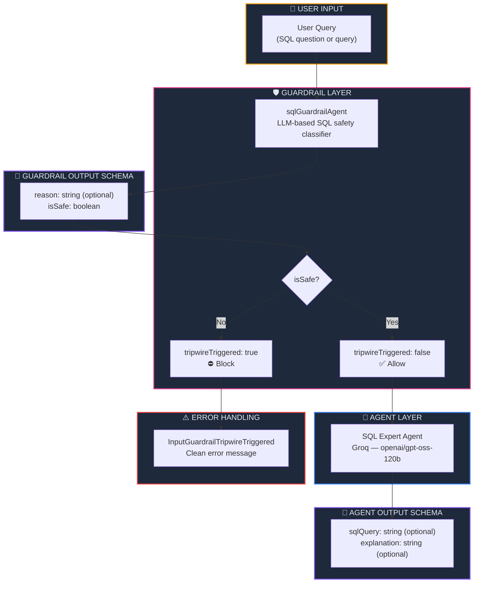

<p align="center">
  
  
  
  
  
</p>

<h1 align="center">🛡️ Output Guardrails in Agents</h1>

<p align="center">
  <strong>Validate and control your AI agent's outputs — use an LLM-powered guardrail to block unsafe SQL queries before they ever reach your database.</strong><br/>
  Part 7 of the <a href="https://github.com/openai/openai-agents-js">OpenAI Agent SDK</a> Series.
</p>

<p align="center">
  <a href="#-quick-start">Quick Start</a> •
  <a href="#-what-are-output-guardrails">What are Output Guardrails?</a> •
  <a href="#%EF%B8%8F-architecture">Architecture</a> •
  <a href="#-key-concepts">Key Concepts</a> •
  <a href="#-troubleshooting">Troubleshooting</a>
</p>

---

## 📖 Overview

This project demonstrates **Output Guardrails** — a safety mechanism that uses an **LLM-based classifier agent** to validate whether a user's SQL query is safe (read-only) before the main SQL agent processes it. Unlike Chapter 06's keyword-based input guardrail, this approach leverages a dedicated **guardrail agent** with structured Zod output to make intelligent safety decisions.

### ✨ Key Highlights

| Feature | Description |
|---------|-------------|
| 🛡️ **LLM-Based Guardrail** | A dedicated agent classifies queries as safe/unsafe — no keyword lists needed |
| ⛔ **Tripwire Pattern** | Halt execution when the guardrail agent detects a dangerous query |
| 🧱 **Structured Output (Zod)** | Both guardrail and main agent use Zod schemas for typed, validated output |
| 🤖 **Dual Agent System** | Guardrail agent + SQL expert agent work in tandem |
| ☁️ **Groq Cloud LLM** | Powered by `openai/gpt-oss-120b` on Groq |
| 🔍 **SQL Explanation** | Agent can both generate and explain SQL queries |

---

## 🧠 What are Output Guardrails?

**Output Guardrails** use a secondary LLM agent to validate and classify input/output *intelligently* — going beyond simple keyword matching. In this project, the guardrail agent evaluates whether a SQL query is **read-only** (safe) or could **modify/delete/drop** data (unsafe).

### Keyword-Based vs LLM-Based Guardrails

| Aspect | Keyword Matching (Ch. 06) | LLM-Based Guardrail (Ch. 07) |
|--------|:------------------------:|:----------------------------:|
| Detection method | String matching against a list | LLM understands intent & context |
| Handles obfuscation | ❌ Easily bypassed | ✅ Understands semantic meaning |
| False positives | ⚠️ High (e.g., "drop me a hint") | ✅ Context-aware decisions |
| Output format | Raw boolean | Structured JSON with `reason` + `isSafe` |
| Extensibility | Must maintain keyword lists | Just update instructions |
| Cost | 💰 Zero — no LLM call | 💸 One extra LLM call per query |

### How the Guardrail Pipeline Works

```mermaid
sequenceDiagram
    participant U as 👤 User
    participant G as 🛡️ Guardrail Agent
    participant A as 🤖 SQL Expert Agent
    participant M as ☁️ Groq LLM

    rect rgb(30, 41, 59)
        Note over U,M: ✅ Safe Query Flow
        U->>G: "SELECT * FROM users;"
        G->>M: Is this query safe?
        M-->>G: { isSafe: true }
        G-->>A: tripwireTriggered: false
        A->>M: Generate/explain SQL
        M-->>A: { sqlQuery: "...", explanation: "..." }
        A-->>U: Result with query & explanation
    end

    rect rgb(50, 20, 20)
        Note over U,M: ⛔ Unsafe Query Flow
        U->>G: "DROP TABLE users;"
        G->>M: Is this query safe?
        M-->>G: { isSafe: false, reason: "DROP modifies schema" }
        G-->>U: tripwireTriggered: true ⛔
        Note over A,M: SQL Agent never runs 🚫
    end
```

---

## 🏗️ Architecture



### 📂 Project Structure

```
07. OutputGuardrailsInAgents/
├── 🎯 index.ts              # Main entry — guardrail agent, SQL agent & error handling
├── 🤖 agent/
│   └── groq.ts              # Groq client & model configuration
├── 🔒 .env                   # Environment variables (GROQ_API_KEY)
├── 📦 package.json           # Dependencies & project metadata
├── ⚙️ tsconfig.json          # TypeScript compiler configuration
├── 🔗 bun.lock               # Bun lockfile
└── 📖 README.md              # You are here
```

---

## 🔑 Key Concepts

### 1. The Guardrail Agent (LLM-Based Classifier)

Instead of a keyword list, a dedicated **agent** with a Zod-typed output decides if input is safe:

```typescript
const sqlGuardrailAgent = new Agent({
  name: 'SQL Guardrail',
  model: groqModel,
  instructions: `
    Check if query is safe to execute.
    The query should be read only and do not modify, delete or drop any table
  `,
  outputType: z.object({
    reason: z.string().optional().describe('reason if the query is unsafe'),
    isSafe: z.boolean().describe('if query is safe to execute'),
  }),
});
```

| Field | Type | Purpose |
|-------|------|---------|
| `isSafe` | `boolean` | `true` → allow the query, `false` → block it |
| `reason` | `string?` | Human-readable reason if the query is unsafe |

### 2. Wiring the Guardrail Agent into an InputGuardrail

The guardrail agent is called inside the `execute` function of an `InputGuardrail`. Its structured output drives the tripwire decision:

```typescript
const sqlGuardrail: InputGuardrail = {
  name: 'SQL Guard',
  async execute({ input }) {
    const result = await run(sqlGuardrailAgent, input);
    console.log('Guardrail result:', result.finalOutput);

    if (!result.finalOutput) {
      return {
        outputInfo: { reason: 'Guardrail response was malformed.' },
        tripwireTriggered: true,
      };
    }

    return {
      outputInfo: result.finalOutput,
      tripwireTriggered: !result.finalOutput.isSafe,
    };
  },
};
```

> **💡 Key pattern:** `run()` the guardrail agent → read its typed `finalOutput` → map `isSafe` to `tripwireTriggered`.

### 3. The Main SQL Agent with Structured Output

The SQL agent uses Zod to produce both SQL queries and explanations:

```typescript
const sqlAgent = new Agent({
  name: 'SQL Expert Agent',
  model: groqModel,
  instructions: `
    You are an expert SQL Agent that is specialized in generating
    and explaining SQL queries as per user request.
    ...
  `,
  outputType: z.object({
    sqlQuery: z.string().optional().describe('sql query if generating one'),
    explanation: z.string().optional().describe('explanation of the query if user asked for one'),
  }),
  inputGuardrails: [sqlGuardrail],
});
```

| Output Field | When Populated |
|-------------|----------------|
| `sqlQuery` | User asks to generate a query (e.g., "show me all tables") |
| `explanation` | User asks to explain a query (e.g., "how does SELECT * work?") |

### 4. Catching Tripwire Errors

When the guardrail agent decides the query is unsafe, the SDK throws `InputGuardrailTripwireTriggered`:

```typescript
try {
    const result = await run(sqlAgent, query);
    console.log('Result:', result.finalOutput);
} catch (e) {
    if (e instanceof InputGuardrailTripwireTriggered) {
        console.log(`⛔ Invalid Input: Rejected because ${e.message}`);
    } else {
        console.error('Unexpected error:', e);
    }
}
```

### 5. Structured Output & Model Compatibility

When using `outputType` with Zod schemas, the SDK sends `response_format: { type: "json_schema" }` to the LLM. Not all models support this:

| Model | `json_schema` Support |
|-------|:--------------------:|
| `openai/gpt-oss-120b` | ✅ |
| `meta-llama/llama-4-scout-17b-16e-instruct` | ✅ |
| `meta-llama/llama-4-maverick-17b-128e-instruct` | ✅ |
| `llama-3.3-70b-versatile` | ❌ |

> **⚠️ Common mistake:** Using `llama-3.3-70b-versatile` with `outputType` — this will throw a `400 BadRequestError` because the model doesn't support `json_schema` response format.

---

## ⚡ Quick Start

### Prerequisites

| Requirement | Minimum Version | Purpose |
|-------------|:--------------:|---------:|
| [Bun](https://bun.sh) | v1.3+ | JavaScript/TypeScript runtime |
| [Groq Account](https://console.groq.com) | Free tier | Cloud LLM inference |

### Step 1 — Install Dependencies

```bash
cd "07. OutputGuardrailsInAgents"
bun install
```

### Step 2 — Configure Environment Variables

Create a `.env` file:

```env
GROQ_API_KEY=gsk_your_groq_api_key_here
```

### Step 3 — Run the Agent

```bash
bun run index.ts
```

### Expected Output (Safe query → allowed)

```
Running SQL agent with query: How this query works:-  SELECT * FROM users;...

Guardrail result: { isSafe: true }
Result: {
  sqlQuery: "SELECT * FROM users;",
  explanation: "This query selects all columns and all rows from the 'users' table..."
}
```

### Try an Unsafe Query

Change the query in `index.ts` to test a destructive operation:

```typescript
main('DROP TABLE users');
```

```
Running SQL agent with query: DROP TABLE users...

Guardrail result: { isSafe: false, reason: "DROP TABLE modifies the database schema" }
⛔ Invalid Input: Rejected because Guardrail SQL Guard triggered tripwire
```

---

## 🔧 Advanced Usage

### Add Output Guardrails (Post-Processing)

In addition to input guardrails (pre-processing), you can add **output guardrails** that validate the agent's *response* before returning it:

```typescript
import type { OutputGuardrail } from '@openai/agents';

const sqlInjectionGuardrail: OutputGuardrail = {
  name: 'sql-injection-check',
  async execute({ agentOutput }) {
    const query = agentOutput?.sqlQuery?.toLowerCase() || '';
    const dangerous = ['--', ';--', 'union select', '1=1'];
    const isSuspicious = dangerous.some(p => query.includes(p));

    return {
      tripwireTriggered: isSuspicious,
      outputInfo: { reason: isSuspicious ? 'Potential SQL injection detected' : 'Clean' },
    };
  },
};

const sqlAgent = new Agent({
  // ...
  outputGuardrails: [sqlInjectionGuardrail],  // 👈 Validates agent output
});
```

### Multiple Guardrails

Stack multiple guardrails — all must pass:

```typescript
const sqlAgent = new Agent({
  inputGuardrails: [
    sqlGuardrail,           // LLM-based safety check
    rateLimitGuardrail,     // Rate limiting
  ],
  outputGuardrails: [
    sqlInjectionGuardrail,  // Post-processing validation
  ],
});
```

---

## 📦 Dependencies

| Package | Version | Purpose |
|---------|---------|---------|
| `@openai/agents` | ^0.11.6 | OpenAI Agents SDK — guardrails, agents & runner |
| `openai` | ^6.42.0 | OpenAI client library (Groq compatibility layer) |
| `dotenv` | ^17.4.2 | Load environment variables from `.env` file |
| `zod` | ^4.4.3 | Runtime schema validation for structured outputs |
| `@types/bun` | latest | TypeScript type definitions for Bun runtime |

---

## 🛠️ Troubleshooting

<details>
<summary><strong>❌ 400 BadRequestError — json_schema not supported</strong></summary>

```
error: 400 This model does not support response format `json_schema`
```

**Cause:** The model specified in `agent/groq.ts` does not support structured outputs via `json_schema`.

**Fix:** Switch to a supported model:
```typescript
// ❌ Does NOT support json_schema
'llama-3.3-70b-versatile'

// ✅ Supports json_schema
'openai/gpt-oss-120b'
'meta-llama/llama-4-scout-17b-16e-instruct'
```
</details>

<details>
<summary><strong>❌ Guardrail response was malformed</strong></summary>

```
Guardrail response was malformed.
```

**Cause:** The guardrail agent returned `null` or `undefined` instead of a valid `{ isSafe, reason }` object.

**Fix:** Ensure the guardrail agent's `outputType` Zod schema matches what the LLM returns, and that the model supports structured outputs.
</details>

<details>
<summary><strong>❌ Unhandled Rejection (No try-catch)</strong></summary>

```
Unhandled rejection ... InputGuardrailTripwireTriggered
```

**Cause:** The tripwire was triggered but `run()` is not wrapped in a `try-catch`.

**Fix:** Always wrap `run()` in error handling:
```typescript
try {
    const result = await run(sqlAgent, query);
} catch (e) {
    if (e instanceof InputGuardrailTripwireTriggered) {
        console.log('⛔ Blocked:', e.message);
    }
}
```
</details>

<details>
<summary><strong>❌ Groq API Key Error</strong></summary>

```
Error: Missing credentials. Please pass an `apiKey`...
```

**Cause:** Missing or incorrect `GROQ_API_KEY` in `.env`.

**Fix:**
```env
GROQ_API_KEY=gsk_your_key_here
```

Get a key at [console.groq.com/keys](https://console.groq.com/keys).
</details>

---

## 🧩 Series Navigation

| # | Module | Topic | Status |
|---|--------|-------|--------|
| 01 | [First Agent Setup](../01.%20First-Agent-Setup/) | Basic agent creation with Ollama | ✅ Complete |
| 02 | [Tool Calling in Agent](../02.%20Tool-Calling-in-Agent/) | Tools, weather API & email integration | ✅ Complete |
| 03 | [Structured Outputs with Zod](../03.%20StructuredAIOutputswithZod/) | Zod validation & structured AI responses | ✅ Complete |
| 04 | [Multi-Agent System](../04.%20Multi-agentSystem/) | Agent delegation & agent-as-tool | ✅ Complete |
| 05 | [Hands-off Multi-Agent](../05.%20Hands-off%20(MultiAgentSystem)/) | Handoffs, receptionist routing & autonomous pipeline | ✅ Complete |
| 06 | [Input Guardrails](../06.%20InputGuardrailsInAgents/) | Input validation, tripwires & safety patterns | ✅ Complete |
| 07 | **Output Guardrails** *(you are here)* | LLM-based guardrail agent, SQL safety & structured output | ✅ Complete |

---

## 📜 License

This project is part of the **OpenAI Agent SDK Series** — built for learning and experimentation.

---

<p align="center">
  <sub>Built with ❤️ using OpenAI Agents SDK & Groq</sub><br/>
  <sub>Validate outputs. Guard your database. 🛡️</sub>
</p>
