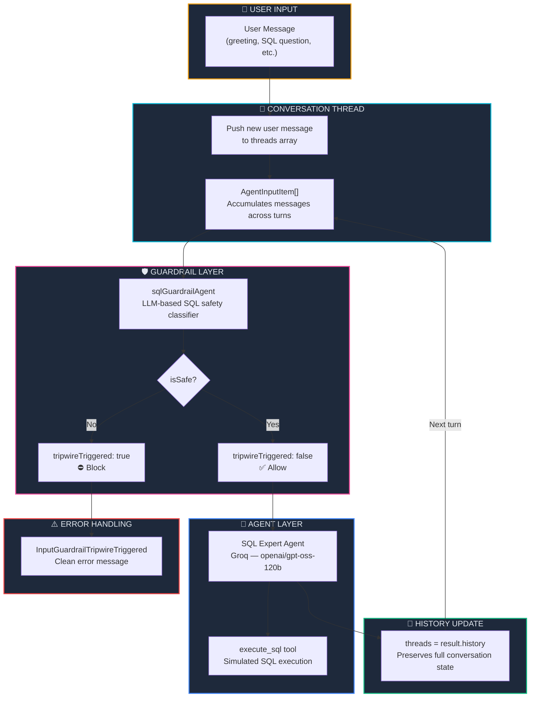

<p align="center">
  
  
  
  
  
</p>

<h1 align="center">💬 Conversation & Chat Threads</h1>

<p align="center">
  <strong>Build multi-turn, stateful AI conversations — maintain chat history across sequential agent runs so your agent remembers context from previous messages.</strong><br/>
  Part 8 of the <a href="https://github.com/openai/openai-agents-js">OpenAI Agent SDK</a> Series.
</p>

<p align="center">
  <a href="#-quick-start">Quick Start</a> •
  <a href="#-what-are-conversation-threads">What are Conversation Threads?</a> •
  <a href="#%EF%B8%8F-architecture">Architecture</a> •
  <a href="#-key-concepts">Key Concepts</a> •
  <a href="#-troubleshooting">Troubleshooting</a>
</p>

---

## 📖 Overview

This project demonstrates **Conversation Threads** — the pattern of maintaining a persistent chat history (`AgentInputItem[]`) across multiple `run()` calls so the AI agent can reference prior messages, remember the user's name, and build on previous answers. It also combines concepts from earlier chapters: **tool calling** (Ch. 02), **input guardrails** (Ch. 06–07), and **LLM-based safety classification**.

### ✨ Key Highlights

| Feature | Description |
|---------|-------------|
| 💬 **Multi-Turn Conversations** | Agent remembers context across sequential messages via `threads` history |
| 🧵 **Thread Management** | Uses `AgentInputItem[]` and `result.history` to maintain conversation state |
| 🛡️ **LLM-Based Input Guardrail** | Guardrail agent classifies SQL queries as safe/unsafe before execution |
| 🔧 **Tool Calling** | `execute_sql` tool simulates database query execution |
| 🤖 **Dual Agent System** | Guardrail agent + SQL expert agent work in tandem |
| ☁️ **Groq Cloud LLM** | Powered by `openai/gpt-oss-120b` on Groq |

---

## 🧠 What are Conversation Threads?

In previous chapters, each `run()` call was **stateless** — the agent had no memory of prior interactions. **Conversation Threads** solve this by passing the full message history to each subsequent `run()` call, enabling the agent to:

- **Remember the user's name** from a greeting message
- **Reference earlier queries** when answering follow-up questions
- **Maintain conversational context** like a real chat assistant

### Stateless vs Stateful Agents

| Aspect | Stateless (Previous Chapters) | Stateful Threads (Ch. 08) |
|--------|:----------------------------:|:-------------------------:|
| Memory | ❌ No memory between calls | ✅ Full conversation history |
| Input type | Single `string` | `AgentInputItem[]` array |
| Context awareness | Each call is independent | Agent references prior messages |
| History tracking | Not available | `result.history` captures full state |
| Use case | One-shot Q&A | Chatbots, multi-step workflows |

### How Conversation Threading Works

```mermaid
sequenceDiagram
    participant U as 👤 User
    participant T as 🧵 Thread (AgentInputItem[])
    participant A as 🤖 SQL Agent
    participant M as ☁️ Groq LLM

    rect rgb(30, 41, 59)
        Note over U,M: 🔵 Turn 1 — Greeting
        U->>T: "Hi, my name is Sanidhya"
        T->>A: threads = [{ role: "user", content: "Hi..." }]
        A->>M: Process with history
        M-->>A: "Hello Sanidhya!"
        A-->>T: threads = result.history (user + assistant msgs)
    end

    rect rgb(20, 50, 30)
        Note over U,M: 🟢 Turn 2 — Follow-up Query
        U->>T: Push new user message to threads
        T->>A: threads = [turn1_user, turn1_assistant, turn2_user]
        A->>M: Process with FULL history
        M-->>A: Responds with context from Turn 1
        A-->>T: threads = result.history (all turns)
    end
```



---

## 🏗️ Architecture



### 📂 Project Structure

```
08. ConversationandChatThreads/
├── 🎯 index.ts              # Main entry — threads, guardrail agent, SQL agent & tool
├── 🤖 agent/
│   └── groq.ts              # Groq client & model configuration
├── 🔒 .env                   # Environment variables (GROQ_API_KEY)
├── 📦 package.json           # Dependencies & project metadata
├── ⚙️ tsconfig.json          # TypeScript compiler configuration
├── 🔗 bun.lock               # Bun lockfile
└── 📖 README.md              # You are here
```

---

## 🔑 Key Concepts

### 1. Initializing the Conversation Thread

The thread is a mutable `AgentInputItem[]` that accumulates messages across turns:

```typescript
import type { AgentInputItem } from '@openai/agents';

let threads: AgentInputItem[] = [];
```

| Property | Type | Description |
|----------|------|-------------|
| `type` | `'message'` | Identifies this as a message item |
| `role` | `'user' \| 'assistant'` | Who sent the message |
| `content` | `string` | The message text |

### 2. Pushing User Messages & Running the Agent

Each turn pushes a new user message onto the thread, then passes the **entire history** to `run()`:

```typescript
async function main(q: string) {
    // Add user message to thread
    threads.push({
        type: 'message',
        role: 'user',
        content: q,
    });

    // Run agent with FULL conversation history
    const result = await run(sqlAgent, threads);

    // Update thread with complete history (includes AI response)
    threads = result.history;
}
```

> **💡 Key pattern:** `result.history` returns the full conversation state (all user messages, assistant responses, tool calls, etc.). Assigning it back to `threads` ensures the next `run()` has complete context.

### 3. Sequential Multi-Turn Execution

Calls are chained with `.then()` to ensure they run in order, preserving conversation flow:

```typescript
main('Hiii My name is Sanidhya-Gupta').then(() => {
    main('Get all the users of my name SELECT * FROM users;');
});
```

| Turn | Message | Agent Behavior |
|------|---------|---------------|
| 1 | `"Hiii My name is Sanidhya-Gupta"` | Agent greets the user, remembers the name |
| 2 | `"Get all the users of my name..."` | Agent references Turn 1 context, processes SQL |

### 4. Tool Calling (`execute_sql`)

The agent has access to a simulated SQL execution tool:

```typescript
const executeSQL = tool({
    name: 'execute_sql',
    description: 'Execute a SQL query against the database',
    parameters: z.object({
        sqlQuery: z.string().describe('SQL query to execute'),
    }),
    async execute({ sqlQuery }) {
        console.log('Executing SQL query:', sqlQuery);
        return { sqlQuery };
    },
});
```

> **Note:** This is a simulated tool — it logs and returns the query but doesn't connect to a real database. Replace the `execute` body with actual DB logic for production use.

### 5. LLM-Based Input Guardrail (Carried from Ch. 07)

The guardrail agent classifies each query before the SQL agent processes it:

```typescript
const sqlGuardrailAgent = new Agent({
    name: 'SQL Guardrail',
    model: groqModel,
    instructions: `Check if query is safe to execute.
        The query should be read only and do not modify, delete or drop any table`,
    outputType: z.object({
        reason: z.string().optional().describe('reason if the query is unsafe'),
        isSafe: z.boolean().describe('if query is safe to execute'),
    }),
});
```

The guardrail is wired into the main agent:

```typescript
const sqlAgent = new Agent({
    // ...
    inputGuardrails: [sqlGuardrail],
});
```

### 6. Catching Tripwire Errors

When the guardrail agent detects an unsafe query, the SDK throws `InputGuardrailTripwireTriggered`:

```typescript
try {
    const result = await run(sqlAgent, threads);
    threads = result.history;
    console.log('Final Output:', result.finalOutput);
} catch (e) {
    if (e instanceof InputGuardrailTripwireTriggered) {
        console.log(`⛔ Invalid Input: Rejected because ${e.message}`);
    } else {
        console.error('Unexpected error:', e);
    }
}
```

---

## ⚡ Quick Start

### Prerequisites

| Requirement | Minimum Version | Purpose |
|-------------|:--------------:|---------:|
| [Bun](https://bun.sh) | v1.3+ | JavaScript/TypeScript runtime |
| [Groq Account](https://console.groq.com) | Free tier | Cloud LLM inference |

### Step 1 — Install Dependencies

```bash
cd "08. ConversationandChatThreads"
bun install
```

### Step 2 — Configure Environment Variables

Create a `.env` file:

```env
GROQ_API_KEY=gsk_your_groq_api_key_here
```

### Step 3 — Run the Agent

```bash
bun start
# or
bun run index.ts
```

### Expected Output

```
Running SQL agent with query: Hiii My name is Sanidhya-Gupta...

Guardrail result: {
  reason: "No query provided",
  isSafe: false,
}
⛔ Invalid Input: Rejected because Input guardrail triggered

Running SQL agent with query: Get all the users of my name SELECT * FROM users;...

Guardrail result: {
  isSafe: true,
}
Executing SQL query: SELECT * FROM users WHERE username = 'Sanidhya-Gupta';
Final Output: ... (SQL result with context from Turn 1)
```

> **Notice:** In Turn 2, the agent remembers "Sanidhya-Gupta" from Turn 1 and uses it to construct a personalized SQL query — this is the power of conversation threads!

---

## 🔧 Advanced Usage

### Interactive Chat Loop

Extend the example into a full interactive chatbot using Bun's readline:

```typescript
import * as readline from 'readline';

const rl = readline.createInterface({
    input: process.stdin,
    output: process.stdout,
});

function ask() {
    rl.question('You: ', async (input) => {
        if (input.toLowerCase() === 'exit') {
            rl.close();
            return;
        }
        await main(input);
        ask(); // Continue the loop
    });
}

ask();
```

### Resetting Conversation State

Clear the thread to start a fresh conversation:

```typescript
function resetConversation() {
    threads = [];
    console.log('🔄 Conversation reset.');
}
```

### Persisting Threads

Save and restore threads to/from a file for persistent conversations:

```typescript
import { writeFileSync, readFileSync } from 'fs';

// Save
writeFileSync('threads.json', JSON.stringify(threads, null, 2));

// Restore
threads = JSON.parse(readFileSync('threads.json', 'utf-8'));
```

---

## 📦 Dependencies

| Package | Version | Purpose |
|---------|---------|---------|
| `@openai/agents` | ^0.11.6 | OpenAI Agents SDK — agents, tools, guardrails & runner |
| `openai` | ^6.42.0 | OpenAI client library (Groq compatibility layer) |
| `dotenv` | ^17.4.2 | Load environment variables from `.env` file |
| `zod` | ^4.4.3 | Runtime schema validation for guardrail output |
| `@types/bun` | latest | TypeScript type definitions for Bun runtime |

---

## 🛠️ Troubleshooting

<details>
<summary><strong>❌ Agent doesn't remember previous messages</strong></summary>

```
Agent responds as if it never saw earlier messages.
```

**Cause:** You're passing a single string to `run()` instead of the full `threads` array, or you're not updating `threads = result.history` after each turn.

**Fix:** Always pass the complete thread and update after each run:
```typescript
const result = await run(sqlAgent, threads);  // ✅ Full history
threads = result.history;                      // ✅ Update state
```
</details>

<details>
<summary><strong>❌ 400 BadRequestError — json_schema not supported</strong></summary>

```
error: 400 This model does not support response format `json_schema`
```

**Cause:** The model specified in `agent/groq.ts` does not support structured outputs via `json_schema`.

**Fix:** Switch to a supported model:
```typescript
// ❌ Does NOT support json_schema
'llama-3.3-70b-versatile'

// ✅ Supports json_schema
'openai/gpt-oss-120b'
'meta-llama/llama-4-scout-17b-16e-instruct'
```
</details>

<details>
<summary><strong>❌ Guardrail blocks non-SQL messages (false positive)</strong></summary>

```
Guardrail result: { isSafe: false, reason: "No query provided" }
```

**Cause:** The guardrail agent classifies non-SQL messages (like greetings) as unsafe because there's no SQL query to evaluate.

**Fix:** This is expected behavior in this demo. For production, consider:
- Adding a pre-filter that skips the guardrail for non-SQL messages
- Updating the guardrail instructions to allow non-SQL conversational messages
</details>

<details>
<summary><strong>❌ Groq API Key Error</strong></summary>

```
Error: Missing credentials. Please pass an `apiKey`...
```

**Cause:** Missing or incorrect `GROQ_API_KEY` in `.env`.

**Fix:**
```env
GROQ_API_KEY=gsk_your_key_here
```

Get a key at [console.groq.com/keys](https://console.groq.com/keys).
</details>

<details>
<summary><strong>❌ Script not found "start"</strong></summary>

```
error: Script not found "start"
```

**Cause:** Running `bun start` from the wrong directory (project root instead of chapter folder).

**Fix:**
```bash
cd "08. ConversationandChatThreads"
bun start
```
</details>

---

## 🧩 Series Navigation

| # | Module | Topic | Status |
|---|--------|-------|--------|
| 01 | [First Agent Setup](../01.%20First-Agent-Setup/) | Basic agent creation with Ollama | ✅ Complete |
| 02 | [Tool Calling in Agent](../02.%20Tool-Calling-in-Agent/) | Tools, weather API & email integration | ✅ Complete |
| 03 | [Structured Outputs with Zod](../03.%20StructuredAIOutputswithZod/) | Zod validation & structured AI responses | ✅ Complete |
| 04 | [Multi-Agent System](../04.%20Multi-agentSystem/) | Agent delegation & agent-as-tool | ✅ Complete |
| 05 | [Hands-off Multi-Agent](../05.%20Hands-off%20(MultiAgentSystem)/) | Handoffs, receptionist routing & autonomous pipeline | ✅ Complete |
| 06 | [Input Guardrails](../06.%20InputGuardrailsInAgents/) | Input validation, tripwires & safety patterns | ✅ Complete |
| 07 | [Output Guardrails](../07.%20OutputGuardrailsInAgents/) | LLM-based guardrail agent, SQL safety & structured output | ✅ Complete |
| 08 | **Conversation & Chat Threads** *(you are here)* | Multi-turn conversations, history management & stateful agents | ✅ Complete |

---

## 📜 License

This project is part of the **OpenAI Agent SDK Series** — built for learning and experimentation.

---

<p align="center">
  <sub>Built with ❤️ using OpenAI Agents SDK & Groq</sub><br/>
  <sub>Remember everything. Converse naturally. 💬</sub>
</p>
