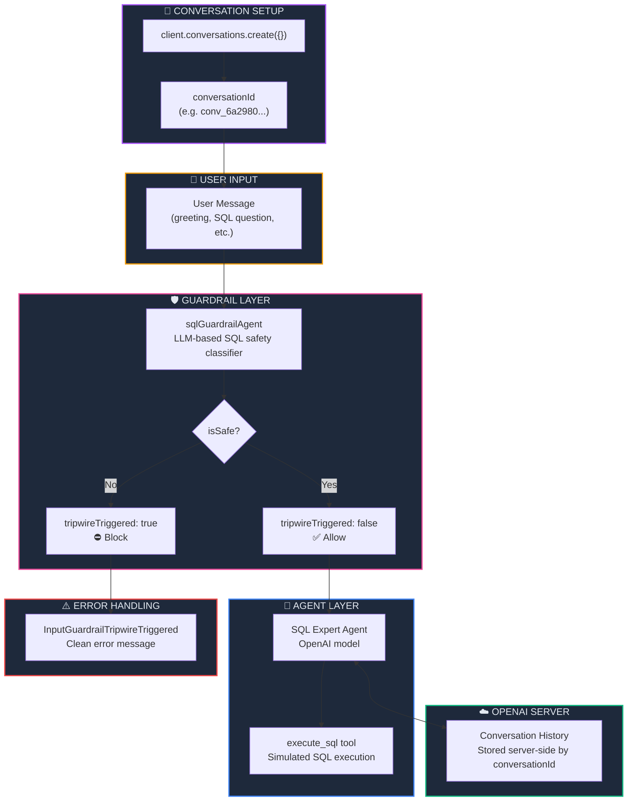

<p align="center">
  
  
  
  
  
</p>

<h1 align="center">🧵 Server-Side Conversations & Chat Threads</h1>

<p align="center">
  <strong>Leverage OpenAI's native Conversations API to maintain persistent, server-side chat threads — no manual history management required.</strong><br/>
  Part 9 of the <a href="https://github.com/openai/openai-agents-js">OpenAI Agent SDK</a> Series.
</p>

<p align="center">
  <a href="#-quick-start">Quick Start</a> •
  <a href="#-client-side-vs-server-side-conversations">Client vs Server</a> •
  <a href="#%EF%B8%8F-architecture">Architecture</a> •
  <a href="#-key-concepts">Key Concepts</a> •
  <a href="#-troubleshooting">Troubleshooting</a>
</p>

---

## 📖 Overview

In Chapter 08, we managed conversation state **client-side** by accumulating an `AgentInputItem[]` array and passing it to every `run()` call. This chapter upgrades to **server-side conversations** using OpenAI's native **Conversations API** — the server stores the full chat history, and you simply pass a `conversationId` to each `run()` call.

### ✨ Key Highlights

| Feature | Description |
|---------|-------------|
| 🧵 **Server-Side Threads** | OpenAI stores conversation history server-side via `client.conversations.create()` |
| 🔗 **Conversation ID** | Each `run()` call references a single `conversationId` — no manual history tracking |
| 🛡️ **LLM-Based Input Guardrail** | Guardrail agent classifies SQL queries as safe/unsafe before execution |
| 🔧 **Tool Calling** | `execute_sql` tool simulates database query execution |
| 🧠 **Persistent Memory** | Agent remembers user's name, prior queries, and context across turns |
| ☁️ **OpenAI LLM** | Powered by OpenAI's models with native Conversations API support |

---

## 🔄 Client-Side vs Server-Side Conversations

| Aspect | Ch. 08 — Client-Side History | Ch. 09 — Server-Side Conversations |
|--------|:---:|:---:|
| **History storage** | Local `AgentInputItem[]` array | OpenAI servers |
| **State management** | Manual — `threads = result.history` | Automatic — pass `conversationId` |
| **Input to `run()`** | Full message array every call | Simple string + `conversationId` |
| **Persistence** | Lost on restart (unless saved to file) | Persists on OpenAI's servers |
| **Provider support** | Any provider (Groq, Ollama, etc.) | OpenAI only |
| **Scalability** | Token window grows with history | Server-managed context |

### Why Server-Side Conversations?

```
❌ Client-Side (Ch. 08)                    ✅ Server-Side (Ch. 09)
─────────────────────                    ──────────────────────
threads.push(userMsg)                    conversationId = conv.id
result = run(agent, threads)  ──►        result = run(agent, query, { conversationId })
threads = result.history                 // That's it. Server remembers everything.
```

---

## 🏗️ Architecture

### How Server-Side Conversations Work

```mermaid
sequenceDiagram
    participant U as 👤 User
    participant C as 🧵 OpenAI Conversations API
    participant A as 🤖 SQL Agent
    participant M as ☁️ OpenAI LLM

    rect rgb(30, 41, 59)
        Note over U,M: 🔵 Setup — Create Conversation Thread
        U->>C: client.conversations.create({})
        C-->>U: conv_6a2980...  (conversationId)
    end

    rect rgb(20, 50, 30)
        Note over U,M: 🟢 Turn 1 — Greeting
        U->>A: run(agent, "Hi, I'm Sanidhya", { conversationId })
        A->>M: Process message
        M-->>C: Store user + assistant messages
        M-->>A: "Hello Sanidhya!"
        A-->>U: finalOutput
    end

    rect rgb(50, 20, 50)
        Note over U,M: 🟣 Turn 2 — Memory Test
        U->>A: run(agent, "What's my name?", { conversationId })
        A->>C: Fetch conversation history
        C-->>A: [Turn 1 messages]
        A->>M: Process with server-stored history
        M-->>A: "Your name is Sanidhya-Gupta!"
        A-->>U: finalOutput
    end
```



### System Architecture



### 📂 Project Structure

```
09. ServerConversation-ChatThreads/
├── 🎯 index.ts              # Main entry — guardrail agent, SQL agent, tool & conversation run
├── 🤖 agent/
│   └── groq.ts              # OpenAI client & conversation thread creation
├── 🔒 .env                   # Environment variables (OPENAI_API_KEY)
├── 📦 package.json           # Dependencies & project metadata
├── ⚙️ tsconfig.json          # TypeScript compiler configuration
├── 🔗 bun.lock               # Bun lockfile
└── 📖 README.md              # You are here
```

---

## 🔑 Key Concepts

### 1. Creating a Server-Side Conversation

The conversation is created once via the OpenAI API. The server assigns a unique `conversationId`:

```typescript
// agent/groq.ts
import OpenAI from "openai";

export const client = new OpenAI({
    apiKey: process.env.OPENAI_API_KEY as string,
});

export const conversation = await client.conversations.create({});
console.log(`🧵 Conversation ID: ${conversation.id}`);
```

| Property | Type | Description |
|----------|------|-------------|
| `conversation.id` | `string` | Unique ID like `conv_6a2980...` — references this thread |
| Server storage | Automatic | OpenAI stores all messages tied to this ID |

### 2. Running the Agent with `conversationId`

Instead of passing a full message array, you pass a simple string query and a `conversationId` — the server handles history:

```typescript
async function main(query: string) {
    console.log(`💬 User: ${query}\n`);

    const result = await run(sqlAgent, query, {
        conversationId: conversation.id,   // ← Server tracks all history
    });

    console.log('🤖 Agent:', result.finalOutput);
}
```

> **💡 Key difference from Ch. 08:** No `threads` array, no `result.history`, no manual state management. Just pass the `conversationId` and the server remembers everything.

### 3. Comparing the Two Approaches

```typescript
// ❌ Ch. 08 — Client-side (manual history)
let threads: AgentInputItem[] = [];
threads.push({ type: 'message', role: 'user', content: q });
const result = await run(sqlAgent, threads);
threads = result.history;

// ✅ Ch. 09 — Server-side (conversationId)
const result = await run(sqlAgent, q, {
    conversationId: conversation.id,
});
// Done. No history tracking needed.
```

### 4. Tool Calling (`execute_sql`)

The agent has access to a simulated SQL execution tool (same as Ch. 08):

```typescript
const executeSQL = tool({
    name: 'execute_sql',
    description: 'Execute a SQL query against the database',
    parameters: z.object({
        sqlQuery: z.string().describe('SQL query to execute'),
    }),
    async execute({ sqlQuery }) {
        console.log('Executing SQL query:', sqlQuery);
        return { sqlQuery };
    },
});
```

> **Note:** This is a simulated tool — it logs and returns the query but doesn't connect to a real database. Replace the `execute` body with actual DB logic for production use.

### 5. LLM-Based Input Guardrail (Carried from Ch. 06–07)

The guardrail agent classifies each query before the SQL agent processes it:

```typescript
const sqlGuardrailAgent = new Agent({
    name: 'SQL Guardrail',
    instructions: `Check if query is safe to execute.
        The query should be read only and do not modify, delete or drop any table`,
    outputType: z.object({
        reason: z.string().optional().describe('reason if the query is unsafe'),
        isSafe: z.boolean().describe('if query is safe to execute'),
    }),
});
```

### 6. Catching Tripwire Errors

When the guardrail detects an unsafe query, the SDK throws `InputGuardrailTripwireTriggered`:

```typescript
try {
    const result = await run(sqlAgent, query, {
        conversationId: conversation.id,
    });
    console.log('🤖 Agent:', result.finalOutput);
} catch (e) {
    if (e instanceof InputGuardrailTripwireTriggered) {
        console.log(`⛔ Invalid Input: Rejected because ${e.message}`);
    } else {
        console.error('Unexpected error:', e);
    }
}
```

---

## ⚡ Quick Start

### Prerequisites

| Requirement | Minimum Version | Purpose |
|-------------|:--------------:|---------:|
| [Bun](https://bun.sh) | v1.3+ | JavaScript/TypeScript runtime |
| [OpenAI Account](https://platform.openai.com) | API key | Cloud LLM inference & Conversations API |

### Step 1 — Install Dependencies

```bash
cd "09. ServerConversation-ChatThreads"
bun install
```

### Step 2 — Configure Environment Variables

Create a `.env` file:

```env
OPENAI_API_KEY=sk-proj-your_openai_api_key_here
```

### Step 3 — Run the Agent

```bash
bun start
# or
bun run index.ts
```

### Expected Output

```
🧵 Conversation ID: conv_6a2980804d9081939a342b6f1806d089076ca6d9c3f715a3

💬 User: SELECT * FROM users
    like my name
    do you remember my name?
    What is my name?

Guardrail result: {
  isSafe: true,
}
🤖 Agent: Your name is Sanidhya-Gupta.

SELECT * FROM users;
```

> **Notice:** The agent remembers "Sanidhya-Gupta" from a previous conversation turn within the same `conversationId` — all history is stored server-side by OpenAI!

---

## 🔧 Advanced Usage

### Reusing a Conversation Across Runs

Since the `conversationId` is persisted on OpenAI's servers, you can hardcode it to resume a conversation even after restarting:

```typescript
const result = await run(sqlAgent, query, {
    conversationId: 'conv_6a297fab7cec8195877f89c470a272cc012e2b4a4103b53a',
});
```

### Creating Multiple Conversation Threads

Run multiple independent conversations in parallel:

```typescript
const conv1 = await client.conversations.create({});
const conv2 = await client.conversations.create({});

// These two conversations are independent
await run(sqlAgent, "My name is Alice", { conversationId: conv1.id });
await run(sqlAgent, "My name is Bob",   { conversationId: conv2.id });

// Each agent only knows its own conversation
await run(sqlAgent, "What's my name?", { conversationId: conv1.id });
// → "Alice"

await run(sqlAgent, "What's my name?", { conversationId: conv2.id });
// → "Bob"
```

### Interactive Chat Loop

Extend the example into a full interactive chatbot:

```typescript
import * as readline from 'readline';

const conv = await client.conversations.create({});

const rl = readline.createInterface({
    input: process.stdin,
    output: process.stdout,
});

function ask() {
    rl.question('You: ', async (input) => {
        if (input.toLowerCase() === 'exit') {
            rl.close();
            return;
        }
        const result = await run(sqlAgent, input, {
            conversationId: conv.id,
        });
        console.log(`Agent: ${result.finalOutput}`);
        ask();
    });
}

ask();
```

---

## 📦 Dependencies

| Package | Version | Purpose |
|---------|---------|---------|
| `@openai/agents` | ^0.11.6 | OpenAI Agents SDK — agents, tools, guardrails & runner |
| `openai` | ^6.42.0 | OpenAI client library (Conversations API) |
| `dotenv` | ^17.4.2 | Load environment variables from `.env` file |
| `zod` | ^4.4.3 | Runtime schema validation for guardrail output |
| `@types/bun` | latest | TypeScript type definitions for Bun runtime |

---

## 🛠️ Troubleshooting

<details>
<summary><strong>❌ 404 Unknown request URL: POST /openai/v1/conversations</strong></summary>

```
error: 404 Unknown request URL: POST /openai/v1/conversations
```

**Cause:** You're using a non-OpenAI provider (Groq, Ollama, etc.) that doesn't support the Conversations API.

**Fix:** The Conversations API is **OpenAI-only**. Switch to an OpenAI API key and remove any custom `baseURL`:
```typescript
// ❌ Groq — does NOT support /v1/conversations
const client = new OpenAI({
    apiKey: process.env.GROQ_API_KEY,
    baseURL: "https://api.groq.com/openai/v1",
});

// ✅ OpenAI — native Conversations API support
const client = new OpenAI({
    apiKey: process.env.OPENAI_API_KEY,
});
```

If you need Groq, use the **client-side history** approach from [Chapter 08](../08.%20ConversationandChatThreads/).
</details>

<details>
<summary><strong>❌ Agent doesn't remember previous messages</strong></summary>

```
Agent responds as if it never saw earlier messages.
```

**Cause:** You're not passing the `conversationId` to the `run()` call, or you created a new conversation for each call.

**Fix:** Create the conversation **once** and reuse the same ID:
```typescript
// Create ONCE
const conversation = await client.conversations.create({});

// Reuse for ALL turns
await run(agent, "msg 1", { conversationId: conversation.id });
await run(agent, "msg 2", { conversationId: conversation.id }); // ✅ remembers msg 1
```
</details>

<details>
<summary><strong>❌ Guardrail blocks non-SQL messages (false positive)</strong></summary>

```
Guardrail result: { isSafe: false, reason: "No query provided" }
```

**Cause:** The guardrail agent classifies non-SQL messages (like greetings) as unsafe.

**Fix:** This is expected in this demo. For production, consider:
- Adding a pre-filter that skips the guardrail for non-SQL messages
- Updating the guardrail instructions to allow conversational messages
</details>

<details>
<summary><strong>❌ OpenAI API Key Error</strong></summary>

```
Error: Missing credentials. Please pass an `apiKey`...
```

**Cause:** Missing or incorrect `OPENAI_API_KEY` in `.env`.

**Fix:**
```env
OPENAI_API_KEY=sk-proj-your_key_here
```

Get a key at [platform.openai.com/api-keys](https://platform.openai.com/api-keys).
</details>

<details>
<summary><strong>❌ Script not found "start"</strong></summary>

```
error: Script not found "start"
```

**Cause:** Running `bun start` from the wrong directory.

**Fix:**
```bash
cd "09. ServerConversation-ChatThreads"
bun start
```
</details>

---

## 🧩 Series Navigation

| # | Module | Topic | Status |
|---|--------|-------|--------|
| 01 | [First Agent Setup](../01.%20First-Agent-Setup/) | Basic agent creation with Ollama | ✅ Complete |
| 02 | [Tool Calling in Agent](../02.%20Tool-Calling-in-Agent/) | Tools, weather API & email integration | ✅ Complete |
| 03 | [Structured Outputs with Zod](../03.%20StructuredAIOutputswithZod/) | Zod validation & structured AI responses | ✅ Complete |
| 04 | [Multi-Agent System](../04.%20Multi-agentSystem/) | Agent delegation & agent-as-tool | ✅ Complete |
| 05 | [Hands-off Multi-Agent](../05.%20Hands-off%20(MultiAgentSystem)/) | Handoffs, receptionist routing & autonomous pipeline | ✅ Complete |
| 06 | [Input Guardrails](../06.%20InputGuardrailsInAgents/) | Input validation, tripwires & safety patterns | ✅ Complete |
| 07 | [Output Guardrails](../07.%20OutputGuardrailsInAgents/) | LLM-based guardrail agent, SQL safety & structured output | ✅ Complete |
| 08 | [Conversation & Chat Threads](../08.%20ConversationandChatThreads/) | Client-side multi-turn conversations & history management | ✅ Complete |
| 09 | **Server-Side Conversations** *(you are here)* | OpenAI Conversations API, server-managed threads & persistent memory | ✅ Complete |

---

## 📜 License

This project is part of the **OpenAI Agent SDK Series** — built for learning and experimentation.

---

<p align="center">
  <sub>Built with ❤️ using OpenAI Agents SDK</sub><br/>
  <sub>Server-side memory. Zero state management. 🧵</sub>
</p>
