# 10. Runtime‑Local Context Management

<div align="center">
  
  
  
  
  
</div>

---

## 📖 Overview

This chapter demonstrates **runtime‑local context management** – the agent keeps the conversation history **in memory** for the duration of the process. Unlike the *server‑side* approach from [Chapter 09](../09.%20ServerConversation-ChatThreads/README.md), no external Conversations API is used; the context lives locally and is passed to each `run()` call.

Key points:

| Feature | Description |
|---------|-------------|
| **🧵 In‑memory thread** | All `AgentInputItem[]` objects are stored in a local array `threads`.
| **⚙️ Stateless restart** | When the process exits the history is lost – ideal for quick demos or edge‑device workloads.
| **🛡️ Guardrails** | Input and output guardrails work exactly as in previous chapters.
| **🔧 Simplicity** | No `conversationId`, fewer network hops, fully self‑contained.

---

## 🚀 Quick Start

### Prerequisites

| Requirement | Minimum Version |
|-------------|-----------------|
| **Bun** | v1.3+ |
| **Node** | v18+ (if you prefer `node` over `bun`) |
| **OpenAI API key** | Required for the LLM calls |

### Install dependencies

```bash
cd "10. RuntimeLocal-ContextManagement"
bun install
```

### Create a `.env` file

```env
OPENAI_API_KEY=sk-your-openai-key-here
```

### Run the example

```bash
bun run index.ts
```

You should see the agent resolve the sample query and print the final output.

---

## 🏗️ Architecture

```mermaid
sequenceDiagram
    participant U as 👤 User
    participant A as 🤖 Agent
    participant M as ☁️ OpenAI LLM
    participant T as 🛠️ Tool (execute_sql)

    rect rgb(30, 41, 59)
        Note over U,M: 🔵 Setup – No external conversation storage
        U->>A: Provide query string
        A->>M: Send messages + current thread
        M-->>A: Response (may call tool T)
        A->>T: execute_sql (if needed)
        T-->>A: Tool result
        A-->>U: finalOutput
    end
```



1. **User input** is appended to the local `threads` array.
2. The **Agent** builds a request that includes the full thread.
3. The **LLM** processes the request; if a tool call is required, the SDK invokes the local tool.
4. The **Agent** updates `threads` with the new assistant message and repeats.

---

## 🔑 Key Concepts

- **Thread management** – `let threads: AgentInputItem[] = []` holds the conversation.
- **Guardrails** – Input guardrails (e.g., SQL safety) are applied before the LLM runs.
- **Tool calling** – Functions like `execute_sql` are defined via `tool({ … })`.
- **Statelessness** – The context lives only in memory; restart clears history.

---

## 🛠️ Advanced Usage

### Persisting the Thread

If you need the history across restarts, serialize `threads` to a JSON file after each turn and reload it on startup:

```typescript
import fs from "fs";

// Load on start
let threads: AgentInputItem[] = [];
if (fs.existsSync("threads.json")) {
  threads = JSON.parse(fs.readFileSync("threads.json", "utf-8"));
}

// After each run
fs.writeFileSync("threads.json", JSON.stringify(threads, null, 2));
```

### Interactive REPL Loop

```typescript
import * as readline from "readline";

const rl = readline.createInterface({ input: process.stdin, output: process.stdout });

async function chat() {
  rl.question("You: ", async (msg) => {
    if (msg.toLowerCase() === "exit") return rl.close();
    threads.push({ type: "message", role: "user", content: msg });
    const result = await run(CustomerQueryAgent, threads);
    console.log(`Agent: ${result.finalOutput}`);
    chat();
  });
}

chat();
```

---

## 📦 Dependencies

| Package | Version | Purpose |
|---------|---------|---------|
| `@openai/agents` | ^0.11.6 | Core SDK – agents, tools, guardrails |
| `openai` | ^6.42.0 | OpenAI client for LLM calls |
| `dotenv` | ^17.4.2 | Load `.env` variables |
| `zod` | ^4.4.3 | Schema validation for guardrails |
| `@types/bun` | latest | Type definitions for Bun |

---

## 🧩 Navigation

| # | Module | Topic |
|---|--------|-------|
| 08 | [Conversation & Chat Threads](../08.%20ConversationandChatThreads/) | Client‑side multi‑turn history |
| 09 | [Server‑Side Conversations](../09.%20ServerConversation-ChatThreads/) | OpenAI Conversations API |
| **10** | **Runtime‑Local Context Management** | **In‑memory thread** |

---

## 📜 License

This material is part of the **OpenAI Agent SDK Series** and is provided under the MIT license.

---

<div align="center">
  <sub>Built with ❤️ using OpenAI Agents SDK</sub><br/>
  <sub>Local memory – no external storage required.</sub>
</div>
