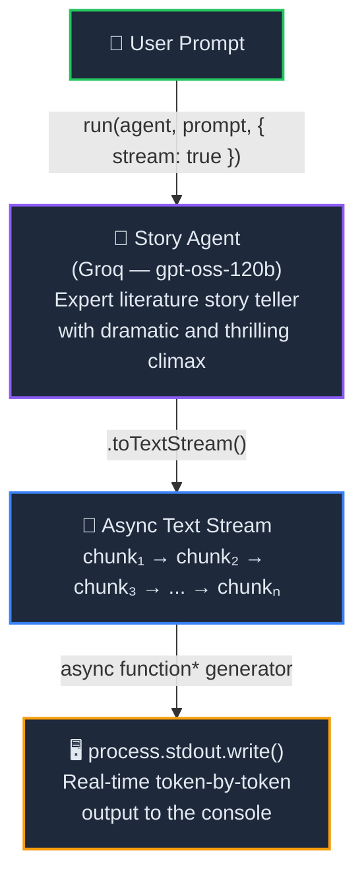

<p align="center">
  
  
  
  
</p>

<h1 align="center">🌊 Chapter 11 — Streaming LLM Responses</h1>

<p align="center">
  <strong>Stream AI-generated text in real-time — token by token — using async generators and the OpenAI Agent SDK's built-in streaming API.</strong><br/>
  Part of the <a href="../README.md">OpenAI Agent SDK Series</a>.
</p>

---

## 📖 Overview

This chapter introduces **real-time streaming** — instead of waiting for the entire LLM response to complete before displaying anything, you stream tokens to the console as they arrive. This creates a smooth, ChatGPT-like "typewriter" experience.

The project wraps the SDK's streaming API inside a custom **async generator function** that yields partial chunks as they arrive and a final complete output when the stream ends.

> **Key Insight:** The `run()` function accepts a `{ stream: true }` option that returns a streamable response. Calling `.toTextStream()` on it gives you an async iterable of text chunks.

---

## 🧠 Concepts Covered

| Concept | Description |
|---------|-------------|
| `{ stream: true }` | Enables streaming mode in the `run()` execution pipeline |
| `.toTextStream()` | Converts the streaming response into an async iterable of text chunks |
| `async function*` | JavaScript async generator — yields values lazily as they arrive |
| `yield` | Emits partial streaming chunks and the final completed output |
| `process.stdout.write()` | Writes raw text without newlines — essential for smooth streaming |
| `for await...of` | Consumes async iterables (the stream and the generator) |

---

## 🏗️ Architecture



---

## 📂 Project Structure

```
11. StreamingLLMResponses/
├── index.ts              # Main entry — streaming logic & async generator
├── agent/
│   └── openai.ts         # Groq model provider configuration
├── .env                  # Environment variables (GROQ_API_KEY)
├── .gitignore
├── package.json
├── tsconfig.json
└── readme.md             # You are here
```

---

## 🔍 Code Walkthrough

### 1. Model Provider — `agent/openai.ts`

Configures a **Groq-hosted** model (`openai/gpt-oss-120b`) through the OpenAI-compatible API:

```typescript
import { OpenAIChatCompletionsModel } from '@openai/agents';
import 'dotenv/config'
import OpenAI from "openai";

const client = new OpenAI({
    apiKey: process.env.GROQ_API_KEY,
    baseURL: "https://api.groq.com/openai/v1",
});

export const groqModel = new OpenAIChatCompletionsModel(
    client,
    'openai/gpt-oss-120b'
)
```

### 2. Story Agent — `index.ts`

A simple agent with creative writing instructions:

```typescript
const StoryAgent = new Agent({
    name: "Story_Agent",
    instructions: `You are a expert literature story teller, write a interesting story with dramatic and thrilling climax`,
    model: groqModel
})
```

### 3. Async Generator — `streamOutput()`

The core of the streaming pattern — an **async generator function** that:
1. Runs the agent with `stream: true`
2. Converts the response to a text stream
3. **Yields** each chunk as it arrives (with `isCompleted: false`)
4. Yields the final output when the stream ends (with `isCompleted: true`)

```typescript
async function* streamOutput(prompt: string) {
    const response = await run(StoryAgent, prompt, { stream: true });
    const stream = response.toTextStream();

    for await (const val of stream) {
        yield { isCompleted: false, content: val };
    }

    yield { isCompleted: true, content: response.finalOutput };
}
```

### 4. Consumer — `main()`

Consumes the generator and writes tokens to stdout in real-time:

```typescript
async function main(query: string) {
    for await (const o of streamOutput(query)) {
        if (o.isCompleted) {
            console.log(o.content);    // Final output (with newline)
        } else {
            process.stdout.write(o.content || '');  // Partial chunk (no newline)
        }
    }
}
```

> **Why `process.stdout.write()` instead of `console.log()`?**  
> `console.log()` appends a newline after every call. When streaming token-by-token, that would put each word on its own line. `process.stdout.write()` outputs raw text without any added newline, creating the smooth typewriter effect.

---

## ⚡ Quick Start

### 1. Install Dependencies

```bash
cd "11. StreamingLLMResponses"
bun install
```

### 2. Set Up Environment

Create a `.env` file:

```env
GROQ_API_KEY=your_groq_api_key_here
```

> Get a free API key at [console.groq.com/keys](https://console.groq.com/keys)

### 3. Run

```bash
bun run index.ts
```

You'll see the story appear **token by token** in real-time, just like ChatGPT's typing effect.

---

## 🔑 Key Takeaways

1. **Streaming is a one-line opt-in** — just add `{ stream: true }` to `run()`
2. **Async generators** are the perfect pattern for streaming — they yield values lazily and let the consumer control the pace
3. **`process.stdout.write()`** is essential for smooth streaming — `console.log()` would break the flow with newlines
4. **`response.finalOutput`** gives you the complete response after the stream finishes — useful for logging, storage, or downstream processing
5. **`.toTextStream()`** converts the SDK's streaming response into a standard async iterable that works with `for await...of`

---

## 🔗 Navigation

| Previous | Series Home | Next |
|:--------:|:-----------:|:----:|
| [10. Runtime-Local Context](../10.%20RuntimeLocal-ContextManagement/) | [📚 All Chapters](../README.md) | [12. Human-in-the-Loop](../12.%20HumanInLoopPattern/) |

---

<p align="center">
  <sub>Built with ❤️ using OpenAI Agents SDK & Groq</sub><br/>
  <sub>Chapter 11 of the OpenAI Agent SDK Series — Real-time streaming, token by token. 🌊</sub>
</p>
