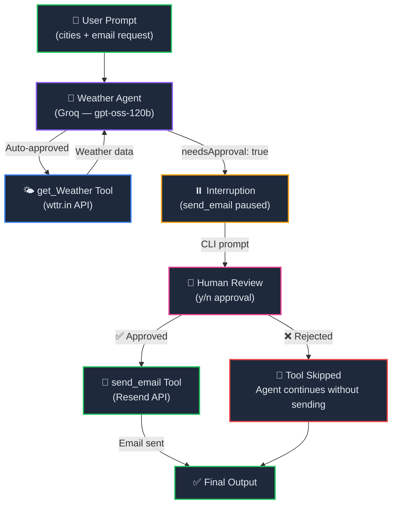

<p align="center">
  
  
  
  
  
</p>

<h1 align="center">🛡️ Chapter 12 — Human-in-the-Loop Pattern</h1>

<p align="center">
  <strong>Add human oversight to your AI agents — require explicit user approval before executing sensitive tools like sending emails, making payments, or deleting data.</strong><br/>
  Part of the <a href="../README.md">OpenAI Agent SDK Series</a>.
</p>

---

## 📖 Overview

This chapter implements the **Human-in-the-Loop (HITL)** pattern — a critical safety mechanism that pauses the agent's execution and asks for human approval before running tools marked as sensitive.

The project builds a **Weather Agent** that:
1. Fetches live weather data for multiple cities using the `wttr.in` API
2. Formats the results with emojis
3. **Pauses and asks the user for permission** before sending the weather summary via email (using Resend)

> **Key Insight:** The OpenAI Agent SDK supports `needsApproval: true` on any tool definition. When the agent tries to call an approved-required tool, the `run()` function returns with `interruptions` instead of executing the tool — giving you full control to approve or reject.

---

## 🧠 Concepts Covered

| Concept | Description |
|---------|-------------|
| `needsApproval: true` | Marks a tool as requiring human approval before execution |
| `res.interruptions` | Array of pending tool calls that need user approval |
| `res.state` | Serializable run state — used to resume after approval/rejection |
| `currentState.approve()` | Approves a specific interruption, allowing the tool to execute |
| `currentState.reject()` | Rejects a specific interruption, preventing the tool from executing |
| `tool_approval_item` | The interruption type for tools requiring approval |
| `readline/promises` | Node.js built-in module for interactive CLI prompts |
| `Resend` | Email delivery service for sending transactional emails |

---

## 🏗️ Architecture



---

## 📂 Project Structure

```
12. HumanInLoopPattern/
├── index.ts                  # Main entry — agent, tools, approval loop
├── agent/
│   └── groq.ts               # Groq model provider configuration
├── resend/
│   ├── resend.config.ts       # Resend email client & sendEmail function
│   └── resend.template.ts     # HTML email template
├── .env                       # Environment variables (API keys, email)
├── .gitignore
├── package.json
├── tsconfig.json
└── README.md                  # You are here
```

---

## 🔍 Code Walkthrough

### 1. Model Provider — `agent/groq.ts`

Configures a **Groq-hosted** model (`openai/gpt-oss-120b`) through the OpenAI-compatible API:

```typescript
import { OpenAIChatCompletionsModel } from '@openai/agents';
import 'dotenv/config'
import OpenAI from "openai";

const client = new OpenAI({
    apiKey: process.env.GROQ_API_KEY,
    baseURL: "https://api.groq.com/openai/v1",
});

export const groqModel = new OpenAIChatCompletionsModel(
    client,
    'openai/gpt-oss-120b'
)
```

### 2. Weather Tool — `get_Weather`

A standard tool (no approval required) that fetches live weather from `wttr.in`:

```typescript
const getWeatherAgent = tool({
    name: 'get_Weather',
    description: `returns the current weather information for the given city`,
    parameters: z.object({
        city: z.string().describe("Enter city name")
    }),
    execute: async ({ city }) => {
        const url = `https://wttr.in/${encodeURIComponent(city.toLowerCase())}?format=3`;
        const res = await axios.get(url, { headers: { Accept: 'text/plain' } });
        return `The current weather in ${city} is ${res.data}`;
    }
});
```

### 3. Email Tool (Approval Required) — `send_email`

The key difference — `needsApproval: true` pauses execution and waits for human confirmation:

```typescript
const sendEmailAgent = tool({
    name: 'send_email',
    description: `Use this tool to send email to user at the end of the process`,
    needsApproval: true,   // ← This is the magic flag
    parameters: z.object({
        to: z.string(),
        subject: z.string(),
        body: z.string(),
    }),
    execute: async ({ to, subject, body }) => {
        await sendEmail(to, subject, body);
    }
})
```

### 4. Human Approval Prompt — `askUserForPermission()`

Uses Node.js `readline/promises` to present a CLI yes/no prompt:

```typescript
async function askUserForPermission(ques: string) {
    const rl = readline.createInterface({
        input: process.stdin,
        output: process.stdout,
    });
    const answer = await rl.question(`${ques} (y/n) :`);
    rl.close();
    return answer.toLowerCase().trim() === 'y' || answer.toLowerCase().trim() === 'yes';
}
```

### 5. Interruption Loop — `main()`

The core pattern — run the agent, check for interruptions, ask user, then resume:

```typescript
async function main(q: string) {
    let res = await run(agent, q);

    let hasInterruptions = res.interruptions.length > 0;
    while (hasInterruptions) {
        const currentState = res.state;
        for (const interupt of res.interruptions) {
            if (interupt.type === 'tool_approval_item') {
                const isAllowed = await askUserForPermission(`
                    Agent ${interupt.agent.name} 
                    asking for calling tool ${interupt.agent?.name} with args
                    ${JSON.stringify(interupt.rawItem)}
                `);
                if (isAllowed) {
                    currentState.approve(interupt);  // ✅ Allow
                } else {
                    currentState.reject(interupt);   // ❌ Deny
                }
                res = await run(agent, currentState); // Resume with decision
                hasInterruptions = res.interruptions?.length > 0;
            }
        }
    }
}
```

> **How does the interruption loop work?**
> 1. `run()` executes until it hits a tool with `needsApproval: true`
> 2. Instead of calling the tool, it returns with `res.interruptions` populated
> 3. You inspect each interruption, ask the user, and call `approve()` or `reject()`
> 4. Call `run()` again with the updated `currentState` to resume execution
> 5. Repeat until no more interruptions remain

---

## ⚡ Quick Start

### Prerequisites

| Requirement | Minimum Version |
|-------------|-----------------|
| **Bun** | v1.3+ |
| **Groq API Key** | Required for LLM calls |
| **Resend API Key** | Required for email delivery |

### 1. Install Dependencies

```bash
cd "12. HumanInLoopPattern"
bun install
```

### 2. Set Up Environment

Create a `.env` file:

```env
GROQ_API_KEY=your_groq_api_key_here
RESEND_API_KEY=your_resend_api_key_here
FROM_EMAIL=Your Name <you@yourdomain.com>
EMAIL_ADDRESS=recipient@example.com
```

> Get a free Groq API key at [console.groq.com/keys](https://console.groq.com/keys)
> Get a Resend API key at [resend.com](https://resend.com)

### 3. Run

```bash
bun run index.ts
```

The agent will:
1. Fetch weather for Los Angeles, Tokyo, and Singapore
2. **Pause and ask you** whether to send the email
3. If you type `y` — the email is sent via Resend
4. If you type `n` — the email is skipped

---

## 🔑 Key Takeaways

1. **`needsApproval: true`** is all it takes to make any tool require human consent — one flag on the tool definition
2. **Interruptions** are the SDK's way of pausing execution — they give you an array of pending actions to approve or reject
3. **`res.state`** captures the full execution state, so you can resume exactly where the agent left off after approval
4. **`approve()` and `reject()`** are called on the state object, not the run result — the state is the resumable checkpoint
5. **The while loop pattern** handles multiple approval-required tools in sequence — the agent may trigger several during one run
6. **Safety-first design** — sensitive operations (email, payments, database writes) should always use this pattern in production

---

## 📦 Dependencies

| Package | Version | Purpose |
|---------|---------|---------|
| `@openai/agents` | ^0.11.6 | Core SDK — agents, tools, interruptions |
| `openai` | ^6.42.0 | OpenAI client (used by Groq adapter) |
| `axios` | ^1.18.0 | HTTP client for weather API calls |
| `resend` | ^6.12.4 | Email delivery service |
| `zod` | ^4.4.3 | Schema validation for tool parameters |
| `dotenv` | ^17.4.2 | Load `.env` variables |
| `@types/bun` | latest | Type definitions for Bun |

---

## 🧩 Navigation

| Previous | Series Home | Next |
|:--------:|:-----------:|:----:|
| [11. Streaming LLM Responses](../11.%20StreamingLLMResponses/) | [📚 All Chapters](../README.md) | _Coming Soon_ |

---

<p align="center">
  <sub>Built with ❤️ using OpenAI Agents SDK & Groq</sub><br/>
  <sub>Chapter 12 of the OpenAI Agent SDK Series — Trust, but verify. 🛡️</sub>
</p>
