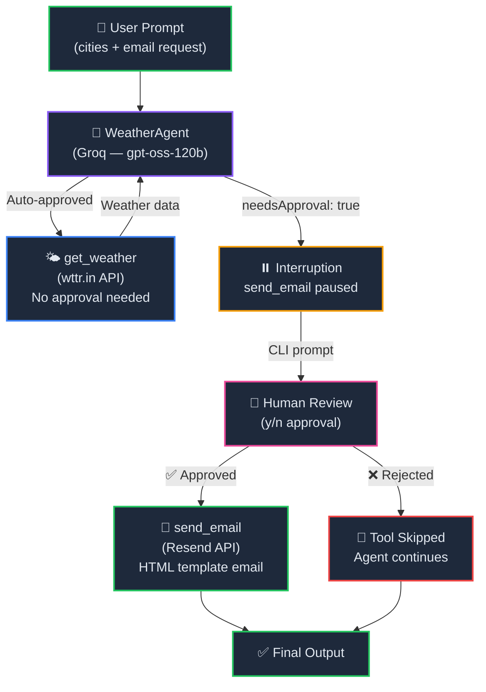

<p align="center">
  
  
  
  
  
</p>

<h1 align="center">🛡️ Chapter 12 — Human-in-the-Loop Pattern</h1>

<p align="center">
  <strong>Add human oversight to your AI agents — require explicit user approval before executing sensitive tools like sending emails, making payments, or deleting data.</strong><br/>
  Part of the <a href="../README.md">OpenAI Agent SDK Series</a>.
</p>

---

## 📖 Overview

This chapter implements the **Human-in-the-Loop (HITL)** pattern — a critical safety mechanism that **pauses agent execution** and asks for human approval before running tools marked as sensitive.

The project builds a **Weather Agent** that:
1. 🌤️ Fetches live weather data for multiple cities using the `wttr.in` API
2. 📝 Formats the results with emojis in a clean bullet list
3. ⏸️ **Pauses and asks the user for permission** before sending the weather summary via email
4. 📧 Delivers the report through [Resend](https://resend.com) with a beautiful HTML template

> **Key Insight:** The OpenAI Agent SDK supports `needsApproval: true` on any tool definition. When the agent tries to call an approval-required tool, `run()` returns with `interruptions` instead of executing the tool — giving you full control to inspect, approve, or reject before anything happens.

---

## 🧠 Concepts Covered

| Concept | Description |
|---------|-------------|
| `needsApproval: true` | Marks a tool as requiring human approval before execution |
| `res.interruptions` | Array of pending tool calls that need user approval |
| `res.state` | Serializable run state — used to resume execution after approval/rejection |
| `state.approve(interrupt)` | Approves a specific interruption, allowing the tool to execute |
| `state.reject(interrupt)` | Rejects a specific interruption, skipping the tool |
| `tool_approval_item` | The interruption type for tools requiring human approval |
| `readline/promises` | Node.js built-in module for interactive CLI prompts |
| `Resend` | Email delivery service for transactional emails |

---

## 🏗️ Architecture



---

## 📂 Project Structure

```
12. HumanInLoopPattern/
├── index.ts                  # Main entry — agent, tools, approval loop & console UI
├── agent/
│   └── groq.ts               # Groq model provider configuration
├── resend/
│   ├── resend.config.ts       # Resend email client & sendEmail helper
│   └── resend.template.ts     # Dark-themed HTML email template
├── .env                       # Environment variables (API keys, email addresses)
├── .gitignore
├── package.json
├── tsconfig.json
└── README.md                  # You are here
```

---

## 🔍 Code Walkthrough

### 1. Model Provider — `agent/groq.ts`

Configures a **Groq-hosted** model (`openai/gpt-oss-120b`) through the OpenAI-compatible API:

```typescript
import { OpenAIChatCompletionsModel } from '@openai/agents';
import 'dotenv/config'
import OpenAI from "openai";

const client = new OpenAI({
    apiKey: process.env.GROQ_API_KEY,
    baseURL: "https://api.groq.com/openai/v1",
});

export const groqModel = new OpenAIChatCompletionsModel(
    client,
    'openai/gpt-oss-120b'
)
```

### 2. Structured Console Logger

A clean logging utility that gives structured, emoji-tagged output for every stage:

```typescript
const log = {
    tool:     (msg: string) => console.log(`\n🔧 [Tool Call]  ${msg}`),
    result:   (msg: string) => console.log(`   ✅ Result:   ${msg.trim()}`),
    approval: (msg: string) => console.log(`\n⏸️  [Approval Required]\n${msg}`),
    approved: ()            => console.log(`   ✅ User approved — executing tool...`),
    rejected: ()            => console.log(`   ❌ User rejected — skipping tool.`),
    success:  (msg: string) => console.log(`\n🎉 [Done]  ${msg}`),
    error:    (msg: string) => console.error(`\n💥 [Error]  ${msg}`),
    divider:  ()            => console.log(`${"─".repeat(60)}`),
};
```

### 3. Weather Tool — `get_weather`

A standard tool (no approval required) that fetches live weather from `wttr.in`:

```typescript
const getWeatherTool = tool({
    name: "get_weather",
    description: "Returns the current weather information for the given city.",
    parameters: z.object({
        city: z.string().describe("The name of the city to get weather for"),
    }),
    execute: async ({ city }) => {
        log.tool(`get_weather("${city}")`);
        const url = `https://wttr.in/${encodeURIComponent(city.toLowerCase())}?format=3`;
        const res = await axios.get(url, { headers: { Accept: "text/plain" } });
        log.result(res.data);
        return `The current weather in ${city} is ${res.data.trim()}`;
    },
});
```

### 4. Email Tool (Approval Required) — `send_email`

The key difference — **`needsApproval: true`** pauses execution and waits for human confirmation:

```typescript
const sendEmailTool = tool({
    name: "send_email",
    description: "Sends an email to the specified recipient.",
    needsApproval: true,   // ← The magic flag — triggers interruption
    parameters: z.object({
        to: z.string().describe("The recipient email address"),
        subject: z.string().describe("Email subject line"),
        body: z.string().describe("Email body content"),
    }),
    execute: async ({ to, subject, body }) => {
        await sendEmail(to, subject, body);
        return `Email sent successfully to ${to}`;
    },
});
```

### 5. Human Approval Prompt — `askUserForApproval()`

Uses Node.js `readline/promises` to present a CLI yes/no prompt:

```typescript
async function askUserForApproval(prompt: string): Promise<boolean> {
    const rl = readline.createInterface({
        input: process.stdin,
        output: process.stdout,
    });
    const answer = await rl.question(`${prompt}\n👉 Approve? (y/n): `);
    rl.close();
    const normalized = answer.toLowerCase().trim();
    return normalized === "y" || normalized === "yes";
}
```

### 6. Interruption Loop — `main()`

The core HITL pattern — run the agent, check for interruptions, ask user for each one, then **resume**:

```typescript
async function main(query: string) {
    let result = await run(weatherAgent, query);

    while (result.interruptions.length > 0) {
        const currentState = result.state;

        for (const interrupt of result.interruptions) {
            if (interrupt.type === "tool_approval_item") {
                // Parse and display the tool call details
                const toolName = interrupt.rawItem.name ?? "unknown_tool";
                const toolArgs = JSON.parse(interrupt.rawItem.arguments ?? "{}");

                log.approval(`   Agent: ${interrupt.agent.name}\n   Tool: ${toolName}`);

                const isAllowed = await askUserForApproval("");

                if (isAllowed) {
                    currentState.approve(interrupt);   // ✅ Allow
                } else {
                    currentState.reject(interrupt);    // ❌ Deny
                }
            }
        }

        // Resume agent with ALL approvals/rejections applied at once
        result = await run(weatherAgent, currentState);
    }

    log.success("Agent finished.");
    console.log(`\n📋 Final Output:\n${result.finalOutput}`);
}
```

> **⚠️ Important:** The `run()` call is placed **outside** the `for` loop. This ensures all pending interruptions are approved/rejected before resuming — otherwise the state gets overwritten mid-iteration.

---

## 💻 Sample Output

```
🤖 WeatherAgent starting...
────────────────────────────────────────────────────────────

🔧 [Tool Call]  get_weather("Los Angeles")
   ✅ Result:   Los Angeles: ☁️  +18°C

🔧 [Tool Call]  get_weather("Tokyo")
   ✅ Result:   Tokyo: 🌤️  +20°C

🔧 [Tool Call]  get_weather("Singapore")
   ✅ Result:   Singapore: 🌤️  +29°C

⏸️  [Approval Required]
   Agent:  WeatherAgent
   Tool:   send_email
   Args:
           {
             "to": "user@example.com",
             "subject": "Current Weather Update",
             "body": "• Los Angeles: ☁️ +18°C\n• Tokyo: 🌤️ +20°C\n• Singapore: 🌤️ +29°C"
           }

👉 Approve? (y/n): y
   ✅ User approved — executing tool...

🔧 [Tool Call]  send_email("user@example.com")
   📨 Subject: Current Weather Update

────────────────────────────────────────────────────────────

🎉 [Done]  Agent finished.

📋 Final Output:
I've sent the weather summary to your email!
```

---

## ⚡ Quick Start

### Prerequisites

| Requirement | Minimum Version |
|-------------|-----------------|
| **Bun** | v1.3+ |
| **Groq API Key** | Required for LLM calls |
| **Resend API Key** | Required for email delivery |

### 1. Install Dependencies

```bash
cd "12. HumanInLoopPattern"
bun install
```

### 2. Set Up Environment

Create a `.env` file:

```env
GROQ_API_KEY=your_groq_api_key_here
RESEND_API_KEY=your_resend_api_key_here
FROM_EMAIL=Your Name <you@yourdomain.com>
EMAIL_ADDRESS=recipient@example.com
```

> Get a free Groq API key at [console.groq.com/keys](https://console.groq.com/keys)  
> Get a Resend API key at [resend.com](https://resend.com)

### 3. Run

```bash
bun run index.ts
```

The agent will:
1. Fetch weather for Los Angeles, Tokyo, and Singapore
2. **Pause and ask you** whether to send the email
3. Type `y` → email is sent via Resend with a beautiful HTML template
4. Type `n` → email is skipped, agent continues gracefully

---

## 🔑 Key Takeaways

1. **`needsApproval: true`** is all it takes to make any tool require human consent — a single flag on the tool definition
2. **Interruptions** are the SDK's way of pausing execution — they return an array of pending tool calls to approve or reject
3. **`res.state`** captures the full execution checkpoint, so you can resume exactly where the agent left off
4. **Process all interruptions before resuming** — call `approve()` / `reject()` on every pending interruption, then call `run()` once with the updated state
5. **The while loop pattern** handles chains of approval-required tools — the agent may trigger several during one run
6. **Safety-first design** — sensitive operations (email, payments, database writes, deletions) should always use this pattern in production

---

## 📦 Dependencies

| Package | Version | Purpose |
|---------|---------|---------|
| `@openai/agents` | ^0.11.6 | Core SDK — agents, tools, interruptions |
| `openai` | ^6.42.0 | OpenAI client (used by Groq adapter) |
| `axios` | ^1.18.0 | HTTP client for weather API calls |
| `resend` | ^6.12.4 | Email delivery service |
| `zod` | ^4.4.3 | Schema validation for tool parameters |
| `dotenv` | ^17.4.2 | Load `.env` variables |
| `@types/bun` | latest | Type definitions for Bun |

---

## 🧩 Navigation

| Previous | Series Home | Next |
|:--------:|:-----------:|:----:|
| [11. Streaming LLM Responses](../11.%20StreamingLLMResponses/) | [📚 All Chapters](../README.md) | _Coming Soon_ |

---

<p align="center">
  <sub>Built with ❤️ using OpenAI Agents SDK & Groq</sub><br/>
  <sub>Chapter 12 of the OpenAI Agent SDK Series — Trust, but verify. 🛡️</sub>
</p>
