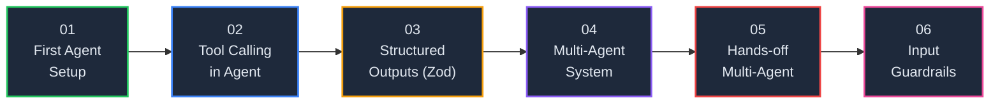
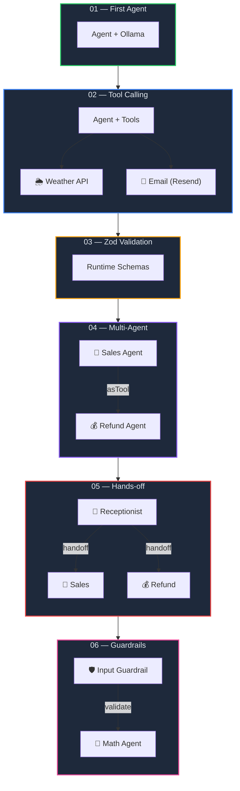

<p align="center">
  
  
  
  
  
  
</p>

<h1 align="center">🤖 OpenAI Agent SDK Series</h1>

<p align="center">
  <strong>A hands-on, progressive series exploring the OpenAI Agent SDK — from your first agent to multi-agent orchestration, guardrails, and beyond.</strong><br/>
  Powered by <a href="https://github.com/openai/openai-agents-js">OpenAI Agents SDK</a>, <a href="https://ollama.com">Ollama</a> & <a href="https://groq.com">Groq</a>.
</p>

<p align="center">
  <a href="#-series-roadmap">Roadmap</a> •
  <a href="#-quick-start">Quick Start</a> •
  <a href="#-chapter-details">Chapters</a> •
  <a href="#-prerequisites">Prerequisites</a> •
  <a href="#-common-dependencies">Dependencies</a>
</p>

---

## 📖 Overview

This repository is a **6-part learning series** that takes you from zero to production-ready AI agent architectures using the [OpenAI Agents SDK](https://github.com/openai/openai-agents-js) (`@openai/agents`) with **TypeScript** and **Bun**. Each chapter builds on the previous one, progressively introducing new concepts.

> **Runtime:** [Bun](https://bun.sh) · **Language:** TypeScript · **LLM Providers:** Ollama (local) & Groq (cloud)

### ✨ What You'll Learn

| Concept | Chapter |
|---------|:-------:|
| Agent creation & execution pipeline | 01 |
| Tool calling & external API integration | 02 |
| Runtime validation with Zod & structured outputs | 03 |
| Multi-agent delegation with `asTool()` | 04 |
| Autonomous handoffs & receptionist routing | 05 |
| Input guardrails & tripwire safety patterns | 06 |

---

## 🗺️ Series Roadmap



| # | Module | Key Concept | LLM Provider | Status |
|:-:|--------|-------------|:------------:|:------:|
| 01 | [First Agent Setup](./01.%20First-Agent-Setup/) | Basic agent creation & execution | Ollama | ✅ |
| 02 | [Tool Calling in Agent](./02.%20Tool-Calling-in-Agent/) | Tools, weather API & email integration | Ollama | ✅ |
| 03 | [Structured Outputs with Zod](./03.%20StructuredAIOutputswithZod/) | Runtime validation & type-safe schemas | Ollama | ✅ |
| 04 | [Multi-Agent System](./04.%20Multi-agentSystem/) | Agent delegation, `asTool()` & file I/O | Ollama + Groq | ✅ |
| 05 | [Hands-off Multi-Agent](./05.%20Hands-off%20(MultiAgentSystem)/) | Handoffs, receptionist routing & autonomous pipeline | Groq | ✅ |
| 06 | [Input Guardrails](./06.%20InputGuardrailsInAgents/) | Input validation, tripwires & safety patterns | Groq | ✅ |

---

## 📚 Chapter Details

### 01. First Agent Setup

> **Path:** [`01. First-Agent-Setup/`](./01.%20First-Agent-Setup/)

Your very first AI agent — connects to a local **Ollama** instance and answers a query. Everything runs on your machine with zero cost.

| Concept | Description |
|---------|-------------|
| `OpenAIChatCompletionsModel` | Wraps Ollama's OpenAI-compatible API |
| `Agent` | Defines name, model & system instructions |
| `run()` | Executes the agent pipeline with a user query |
| `setTracingDisabled(true)` | Required for non-OpenAI model providers |

```bash
cd "01. First-Agent-Setup" && bun install && bun run index.ts
```

---

### 02. Tool Calling in Agent

> **Path:** [`02. Tool-Calling-in-Agent/`](./02.%20Tool-Calling-in-Agent/)

Give your agent **superpowers** — it autonomously fetches live weather data from [wttr.in](https://wttr.in) and sends premium HTML email reports via [Resend](https://resend.com).

| Concept | Description |
|---------|-------------|
| `tool()` | Define callable tools with Zod-validated parameters |
| Dynamic instructions | `instructions` as an async function for context-aware prompts |
| Tool chaining | Agent fetches weather → formats data → sends email |
| Modular architecture | Separate layers for agent, tools & email |

```bash
cd "02. Tool-Calling-in-Agent" && bun install && bun run agent-tools/tools.ts
```

**Requires:** `RESEND_API_KEY`, `FROM_EMAIL`, `EMAIL_ADDRESS` in `.env`

---

### 03. Structured AI Outputs with Zod

> **Path:** [`03. StructuredAIOutputswithZod/`](./03.%20StructuredAIOutputswithZod/)

A focused deep-dive into **Zod** — the runtime validation library that powers type-safe tool parameters and structured AI responses across the entire series.

| Concept | Description |
|---------|-------------|
| `z.object()` | Define the exact shape data must follow |
| `.safeParse()` | Validate without throwing — get detailed error reports |
| `z.infer<typeof Schema>` | One schema → runtime validation + TypeScript types |
| `outputType` | Force the entire agent response into a Zod schema |

```bash
cd "03. StructuredAIOutputswithZod" && bun install && bun run index.ts
```

---

### 04. Multi-Agent System

> **Path:** [`04. Multi-agentSystem/`](./04.%20Multi-agentSystem/)

The first **multi-agent** project — a Sales Agent delegates refund processing to a Refund Agent. Demonstrates dual model providers (Ollama + Groq) and file I/O.

| Concept | Description |
|---------|-------------|
| `agent.asTool()` | Convert an agent into a tool callable by another agent |
| Multi-model setup | Sales Agent → Ollama, Refund Agent → Groq |
| File I/O in tools | `process_Refund` appends data to `refunds.txt` |
| Agent delegation | Sales Agent decides when to hand off to Refund Agent |

```
User Query → Sales Agent (Ollama) → Refund Agent (Groq) → refunds.txt
```

```bash
cd "04. Multi-agentSystem" && bun install && bun run index.ts
```

**Requires:** `GROQ_API_KEY` in `.env`

---

### 05. Hands-off Multi-Agent System

> **Path:** [`05. Hands-off (MultiAgentSystem)/`](./05.%20Hands-off%20(MultiAgentSystem)/)

A fully **autonomous pipeline** — a Receptionist Agent triages requests and hands off to the right specialist. No follow-up questions, no human approval.

| Concept | Description |
|---------|-------------|
| `handoffs` | Agent-to-agent control transfer — the receiving agent takes over |
| `RECOMMENDED_PROMPT_PREFIX` | SDK's built-in prefix for reliable handoff behavior |
| Receptionist pattern | Central router that dispatches to specialist agents |
| Dual routing paths | Direct handoff + nested `asTool()` delegation |

```
User → Receptionist → Sales Agent or Refund Agent → Result
```

```bash
cd "05. Hands-off (MultiAgentSystem)" && bun install && bun run index.ts
```

**Requires:** `GROQ_API_KEY` in `.env`

---

### 06. Input Guardrails in Agents

> **Path:** [`06. InputGuardrailsInAgents/`](./06.%20InputGuardrailsInAgents/)

Protect your agents from off-topic or harmful inputs using **Input Guardrails**. A math-only agent rejects non-mathematical queries before the LLM even processes them.

| Concept | Description |
|---------|-------------|
| `InputGuardrail` | Define validation logic that runs before the agent |
| `tripwireTriggered` | Boolean flag that halts agent execution when `true` |
| `InputGuardrailTripwireTriggered` | Catchable error class for clean user-facing messages |
| `outputInfo` | Structured metadata explaining why input was accepted/rejected |

```typescript
// Guardrail returns { tripwireTriggered: true } → agent never runs
// Guardrail returns { tripwireTriggered: false } → agent proceeds normally
```

```bash
cd "06. InputGuardrailsInAgents" && bun install && bun run index.ts
```

**Requires:** `GROQ_API_KEY` in `.env`

---

## 🏗️ Architecture Overview



---

## 📂 Repository Structure

```
12. OpenAI-Agent-SDK-Series/
├── 📖 README.md                              # You are here
│
├── 01. First-Agent-Setup/                     # 🤖 Basic agent + Ollama
│   ├── index.ts
│   └── package.json
│
├── 02. Tool-Calling-in-Agent/                 # 🛠️ Weather + Email tools
│   ├── index.ts
│   ├── agent/ollama.ts
│   ├── agent-tools/tools.ts
│   └── resend/
│       ├── resend.config.ts
│       └── resend.template.ts
│
├── 03. StructuredAIOutputswithZod/            # 🛡️ Zod validation deep-dive
│   ├── index.ts
│   └── agent/ollama.ts
│
├── 04. Multi-agentSystem/                     # 🔀 Agent delegation (asTool)
│   ├── index.ts
│   ├── agent/ollama.ts
│   └── agent/groq.ts
│
├── 05. Hands-off (MultiAgentSystem)/          # 🔄 Handoffs & receptionist
│   ├── index.ts
│   └── agent/groq.ts
│
└── 06. InputGuardrailsInAgents/               # 🛡️ Input guardrails & tripwires
    ├── index.ts
    └── agent/groq.ts
```

---

## ⚡ Quick Start

### Step 1 — Clone the Repository

```bash
git clone <repo-url>
cd "12. OpenAI-Agent-SDK-Series"
```

### Step 2 — Start with Chapter 01

```bash
cd "01. First-Agent-Setup"
bun install
bun run index.ts
```

### Step 3 — Work Through Each Chapter

Progress through the chapters in order (01 → 06) for the best learning experience. Each chapter builds on concepts from the previous one.

---

## 🔧 Prerequisites

| Requirement | Minimum Version | Used In | Purpose |
|-------------|:--------------:|:-------:|---------| 
| [Bun](https://bun.sh) | v1.3+ | All | JavaScript/TypeScript runtime |
| [Ollama](https://ollama.com) | Latest | 01–04 | Local LLM inference server |
| [Groq Account](https://console.groq.com) | Free tier | 04–06 | Cloud LLM provider |
| [Resend Account](https://resend.com) | Free tier | 02 | Email delivery service |

### Ollama Models Required

```bash
ollama pull qwen2.5:1.5b   # Chapter 01
ollama pull qwen2.5:7b      # Chapters 02, 03, 04
```

### Environment Variables

| Variable | Chapters | Description |
|----------|:--------:|-------------|
| `GROQ_API_KEY` | 04, 05, 06 | Groq API key ([get one](https://console.groq.com/keys)) |
| `RESEND_API_KEY` | 02 | Resend API key ([get one](https://resend.com/api-keys)) |
| `FROM_EMAIL` | 02 | Sender email for Resend |
| `EMAIL_ADDRESS` | 02 | Recipient email for weather reports |

---

## 📦 Common Dependencies

| Package | Purpose | Chapters |
|---------|---------|:--------:|
| `@openai/agents` | OpenAI Agent SDK — core framework | All |
| `openai` | OpenAI client (Ollama & Groq compatibility) | All |
| `zod` | Runtime schema validation & type inference | 02–06 |
| `dotenv` | Environment variable loading | All |
| `axios` | HTTP client (weather API) | 02, 04 |
| `resend` | Email delivery service | 02 |

---

## 🧠 Concept Progression

```
Chapter 01: Agent ← simple query/response
Chapter 02: Agent + Tools ← external API calls
Chapter 03: Agent + Zod ← structured, validated outputs
Chapter 04: Agent + Agent (asTool) ← multi-agent delegation
Chapter 05: Agent + Agent (handoffs) ← autonomous routing
Chapter 06: Agent + Guardrails ← input safety & validation
```

Each chapter introduces **one new concept** while reinforcing the previous ones. By Chapter 06, you'll have covered the full spectrum of the OpenAI Agent SDK's capabilities.

---

## 📜 License

This project is built for **learning and experimentation**. Feel free to use, modify, and build upon it.

---

<p align="center">
  <sub>Built with ❤️ using OpenAI Agents SDK, Ollama & Groq</sub><br/>
  <sub>From your first agent to production-ready guardrails. 🤖→🛡️</sub>
</p>
