# 🧠 Generative AI Masterclass: From Fundamentals to Agentic Autonomy ✨


<div align="center">


</div>

<p align="center">
  <strong>The ultimate hands-on repository for mastering Generative AI — from tokenization theory to production-grade autonomous agent systems.</strong><br/>
  14 Conceptual Foundations • 12 Production Projects • 13-Part Agent SDK Deep-Dive
</p>

---

## 📖 What Is This Repository?

This is a **structured, progressive learning system** for Generative AI engineering. It's not just a collection of code samples — it's a complete curriculum designed to build deep conceptual understanding alongside practical implementation skills.

The repository follows a deliberate pedagogical arc:

```
Theory → Fundamentals → Applied Projects → Advanced Orchestration → Autonomous Agents
```

You'll start by understanding **what tokens are** and end by building **multi-agent systems** that use tools, maintain memory, enforce safety guardrails, stream responses in real-time, and discover external capabilities through Model Context Protocol (MCP).

> **Philosophy:** Every project in this repository is built with real-world production patterns. No toy demos — each implementation solves a genuine engineering problem.

---

## 🌟 Why This Repository?

In a world rapidly evolving with AI, staying ahead means understanding the **"Why"** and the **"How"**. This repo doesn't just show you how to call an API — it dives into the architecture, the math, and the orchestration that makes AI feel like magic. 🪄

### 💎 Core Pillars

| Pillar | What You'll Master | Why It Matters |
|--------|-------------------|----------------|
| ⚙️ **Core Mechanics** | Tokens, Context Windows, Temperature, Inference | Understanding the engine before driving the car |
| 📐 **Prompt Engineering** | CO-STAR, Few-Shot, Chain of Thought, ReAct | The difference between a good and bad AI response |
| 📚 **RAG Systems** | Embeddings, Vector DBs, Retrieval-Augmented Generation | Grounding AI in your own data, eliminating hallucination |
| 🤖 **Agentic AI** | Tool Calling, Multi-Agent Systems, Autonomous Routing | AI that *acts*, not just *answers* |
| 🛡️ **Safety & Guardrails** | Input/Output Validation, Tripwires, Human-in-the-Loop | Keeping AI safe for production deployment |
| 🕸️ **Advanced Orchestration** | LangGraph, LangChain, LangSmith, MCP | Production-grade multi-agent pipelines with observability |
| 🧠 **Memory Management** | Context Injection, Conversation Threads, Server-Side State | AI that remembers and maintains context |
| 💻 **Local-First AI** | Ollama, Docker Model Runner, SLMs | Full privacy, zero cloud, zero API keys |

---

## 🏗️ Repository Architecture

The learning path is divided into two main pillars, each building on the other:

```mermaid
flowchart TD
    ROOT["🧠 GenAI Masterclass"] --> BASIC["📂 1. Basic-UseCase\nThe Foundation"]
    ROOT --> ADV["📂 2. Advance-GenAI\nThe Frontier"]
    
    BASIC --> B1["🔢 Tokenization & Core Mechanics"]
    BASIC --> B2["📐 Prompt Engineering (CO-STAR)"]
    BASIC --> B3["📊 Structured Outputs & Validation"]
    BASIC --> B4["📚 Embeddings & Vector Databases"]
    BASIC --> B5["🏢 RAG Architecture"]
    
    ADV --> A1["🤖 Agentic Applications"]
    ADV --> A2["🕸️ Orchestration Frameworks"]
    ADV --> A3["🛡️ Safety & Guardrails"]
    ADV --> A4["🧠 Memory & State"]
    ADV --> A5["🔌 MCP & Interoperability"]
    ADV --> A6["📖 13-Part Agent SDK Series"]
    
    style ROOT fill:#1e293b,stroke:#a855f7,stroke-width:3px,color:#e2e8f0
    style BASIC fill:#1e293b,stroke:#22c55e,stroke-width:2px,color:#e2e8f0
    style ADV fill:#1e293b,stroke:#3b82f6,stroke-width:2px,color:#e2e8f0
    style B1 fill:#0f172a,stroke:#4ade80,color:#e2e8f0
    style B2 fill:#0f172a,stroke:#4ade80,color:#e2e8f0
    style B3 fill:#0f172a,stroke:#4ade80,color:#e2e8f0
    style B4 fill:#0f172a,stroke:#4ade80,color:#e2e8f0
    style B5 fill:#0f172a,stroke:#4ade80,color:#e2e8f0
    style A1 fill:#0f172a,stroke:#60a5fa,color:#e2e8f0
    style A2 fill:#0f172a,stroke:#60a5fa,color:#e2e8f0
    style A3 fill:#0f172a,stroke:#60a5fa,color:#e2e8f0
    style A4 fill:#0f172a,stroke:#60a5fa,color:#e2e8f0
    style A5 fill:#0f172a,stroke:#60a5fa,color:#e2e8f0
    style A6 fill:#0f172a,stroke:#f59e0b,stroke-width:2px,color:#e2e8f0
```



---

## 📂 Pillar 1 — [Basic-UseCase](./1.%20Basic-UseCase) 🧱 The Foundation

> **Concept:** Before you can build intelligent systems, you need to understand the primitives — how LLMs think, how they process language, and how to communicate with them effectively.

This pillar covers **14 conceptual topics** across two practical projects, forming the theoretical backbone of everything that follows.

### 🧩 Conceptual Topics Covered

<details>
<summary><strong>Click to expand all 14 topics</strong></summary>

| # | Topic | Core Concept |
|:-:|-------|-------------|
| 1 | **Tokens** | The atomic units of LLM processing — 1 token ≈ ¾ of a word. Understanding tokens is critical for pricing, rate limits, and context window management. |
| 2 | **Temperature** | Controls output randomness by scaling logits before softmax. Low (0.0–0.3) = deterministic; High (0.8–1.2) = creative. |
| 3 | **Hallucination** | When LLMs generate plausible but incorrect information. Mitigated through RAG, lower temperature, CoT, and validation. |
| 4 | **Context Window** | The model's "working memory" — from 16K tokens (GPT-3.5) to 1M tokens (Gemini 1.5 Pro). |
| 5 | **CO-STAR Framework** | Structured prompt engineering: Context, Objective, Style, Tone, Audience, Response. |
| 6 | **Few-Shot Learning** | Providing 2–10 examples in-prompt improves accuracy by 20–40% without fine-tuning. |
| 7 | **Formatting & Instructions** | XML tags, delimiters, and Chain of Thought ("Think step-by-step") for 30–50% reasoning improvement. |
| 8 | **JSON Outputs** | Structured outputs via Function Calling, JSON Mode, or prompt engineering. |
| 9 | **Zod Validation** | Runtime type-safe schema validation — one schema gives you both TypeScript types and runtime checks. |
| 10 | **Validation & Retry** | Schema validation, safety filtering, and smart retry (feed errors back to the LLM for self-correction). |
| 11 | **Embeddings** | Numerical vectors (384–3072 dimensions) that encode semantic meaning. Cosine similarity > 0.8 = highly similar. |
| 12 | **Vector Databases** | Specialized storage for semantic search: Pinecone (managed), ChromaDB (local), pgvector (PostgreSQL). |
| 13 | **RAG Architecture** | Retrieval-Augmented Generation: Chunk → Embed → Store → Query → Retrieve → Generate grounded answers. |
| 14 | **Search Optimization** | Hybrid search (semantic + BM25), chunking strategies, reranking with cross-encoders, and HyDE. |

</details>

### 📁 Foundation Projects

| Project | Description | Key Technologies |
|---------|-------------|-----------------|
| [**company-chatbot**](./1.%20Basic-UseCase/company-chatbot) | A complete **RAG pipeline** — parse a company PDF, chunk it, generate embeddings, store in a vector database, and query it with semantic search. The definitive hands-on intro to production RAG. | TypeScript, OpenAI, Vector DB, PDF parsing |
| [**invoking-llms**](./1.%20Basic-UseCase/invoking-llms) | Learn how to interact with **multiple LLM providers** (OpenAI, Anthropic, etc.) through standardized APIs. Includes a web-based chatbot interface and server-side integration patterns. | JavaScript, Node.js, Multi-provider APIs |

---

## 📂 Pillar 2 — [Advance-GenAI](./2.%20Advance-GenAI) 🌌 The Frontier

> **Concept:** This is where theory meets real-world complexity. Each project tackles a production-grade challenge — from autonomous agents and multi-model orchestration to full-stack AI applications and privacy-first local inference.

### 🗺️ Project Roadmap

```mermaid
flowchart LR
    P01["01\nAI Todo\nApp"] --> P02["02\nWebPage\nSupport"]
    P02 --> P03["03\nLangGraph &\nLangChain"]
    P03 --> P04["04\nLLM\nClash"]
    P04 --> P05["05\nMCP"]
    P05 --> P06["06\nHow LLMs\nWork"]
    P06 --> P07["07\nAI Chat\nPDF RAG"]
    P07 --> P08["08\nOwn\nAI IDE"]
    P08 --> P09["09\nMemory\nManagement"]
    P09 --> P10["10\nOpenAI\nAgent SDK"]
    P10 --> P11["11\nRun Locally\n(DMR)"]
    P11 --> P12["12\nAgent SDK\nSeries (×13)"]

    style P01 fill:#1e293b,stroke:#22c55e,stroke-width:2px,color:#e2e8f0
    style P02 fill:#1e293b,stroke:#3b82f6,stroke-width:2px,color:#e2e8f0
    style P03 fill:#1e293b,stroke:#f59e0b,stroke-width:2px,color:#e2e8f0
    style P04 fill:#1e293b,stroke:#8b5cf6,stroke-width:2px,color:#e2e8f0
    style P05 fill:#1e293b,stroke:#ef4444,stroke-width:2px,color:#e2e8f0
    style P06 fill:#1e293b,stroke:#ec4899,stroke-width:2px,color:#e2e8f0
    style P07 fill:#1e293b,stroke:#14b8a6,stroke-width:2px,color:#e2e8f0
    style P08 fill:#1e293b,stroke:#06b6d4,stroke-width:2px,color:#e2e8f0
    style P09 fill:#1e293b,stroke:#a855f7,stroke-width:2px,color:#e2e8f0
    style P10 fill:#1e293b,stroke:#f97316,stroke-width:2px,color:#e2e8f0
    style P11 fill:#1e293b,stroke:#06d6a0,stroke-width:2px,color:#e2e8f0
    style P12 fill:#1e293b,stroke:#e11d48,stroke-width:3px,color:#e2e8f0
```



---

### 01. 🤖 [AI-TodoApp](./2.%20Advance-GenAI/01.%20AI-TodoApp) — Agentic State Management

> **Concept:** An AI agent that doesn't just respond to queries but **manages persistent state**. It creates, updates, and deletes todos through natural language — demonstrating how agents can interact with databases as a side effect of conversation.

| Aspect | Detail |
|--------|--------|
| **Architecture** | Agent → Tool Calls → Drizzle ORM → PostgreSQL (Docker) |
| **Key Pattern** | Agentic CRUD — the LLM decides *which* database operation to invoke based on natural language |
| **Technologies** | TypeScript, Bun, OpenAI, Drizzle ORM, PostgreSQL, Docker Compose |

---

### 02. 🌐 [WebPage-SupportPage](./2.%20Advance-GenAI/02.%20WebPage-SupportPage) — Automated Customer Support

> **Concept:** An end-to-end customer support pipeline that integrates AI with real-time web data. Demonstrates how LLMs can serve as the intelligence layer in a customer-facing system.

| Aspect | Detail |
|--------|--------|
| **Architecture** | Web Frontend → API Layer → LLM Processing → Response |
| **Key Pattern** | Context-aware support — grounding responses in live web content |
| **Technologies** | JavaScript, Node.js, Web APIs |

---

### 03. 🕸️ [LangGraph, LangChain & LangSmith](./2.%20Advance-GenAI/03.%20Langgraph,%20Langchain%20and%20Langsmith) — Orchestration & Observability

> **Concept:** Move beyond single-agent systems into **graph-based multi-agent orchestration**. LangGraph provides the state machine, LangChain provides the abstractions, and LangSmith provides the production observability (tracing, debugging, evaluation).

| Aspect | Detail |
|--------|--------|
| **Architecture** | State Graph → Conditional Edges → Agent Nodes → LangSmith Traces |
| **Key Pattern** | Graph-based routing — agents as nodes, decisions as edges |
| **Technologies** | LangGraph, LangChain, LangSmith |

---

### 04. ⚔️ [LLM-Clash](./2.%20Advance-GenAI/04.%20LLM-Clash) — Model Benchmarking Framework

> **Concept:** A comparative framework to systematically **benchmark different LLMs** (GPT-4 vs Llama 3 vs DeepSeek) on logic, coding, and reasoning tasks. Reveals the actual performance differences between models — not marketing claims.

| Aspect | Detail |
|--------|--------|
| **Architecture** | Task Suite → Multi-Provider Runner → Comparative Analysis |
| **Key Pattern** | Controlled benchmarking — same prompts, different models, structured evaluation |
| **Technologies** | TypeScript, Multi-provider APIs |

---

### 05. 🔌 [MCP](./2.%20Advance-GenAI/05.%20MCP) — Model Context Protocol

> **Concept:** The **open standard for LLM-tool interoperability**. Instead of hardcoding tool integrations, MCP lets agents dynamically discover and use external tools through a standardized protocol — think "USB for AI".

| Aspect | Detail |
|--------|--------|
| **Architecture** | MCP Client → Protocol Layer → MCP Server → Tool Execution |
| **Key Pattern** | Runtime tool discovery — agents find and use tools they've never seen before |
| **Technologies** | TypeScript, MCP Protocol, Bun |

---

### 06. 📖 [How LLMs Work](./2.%20Advance-GenAI/06.%20How-LLMs-Works) — Deep Theoretical Dive

> **Concept:** A comprehensive theoretical breakdown of **Transformer architecture** — from Attention mechanisms and positional encoding to training pipelines and inference optimization. This is the "under the hood" chapter.

| Aspect | Detail |
|--------|--------|
| **Content** | Transformer blocks, Self-Attention, Multi-Head Attention, Feed-Forward Networks, Training (pre-training, fine-tuning, RLHF) |
| **Key Insight** | Understanding *why* LLMs behave the way they do — not just *how* to use them |
| **Format** | Technical documentation with architectural diagrams |

---

### 07. 📄 [AI-Chat-PDF-RAG](./2.%20Advance-GenAI/07.%20AI-Chat-PDF-RAG) — Full-Stack RAG Application

> **Concept:** A complete, production-quality full-stack application for **chatting with PDF documents**. This isn't a CLI script — it's a deployed web app with authentication, database persistence, and a modern glassmorphism UI.

| Aspect | Detail |
|--------|--------|
| **Architecture** | Next.js Frontend → Clerk Auth → Neon PostgreSQL → Groq AI → RAG Pipeline |
| **Key Pattern** | Full-stack RAG — from PDF upload to conversational retrieval with auth and persistence |
| **Technologies** | Next.js, React, Clerk, Neon PostgreSQL, Groq, Qdrant, Docker |

---

### 08. 💻 [Own-AI-IDE](./2.%20Advance-GenAI/08.%20Own-AI-IDE) — AI-Powered Code Generator

> **Concept:** An AI agent that takes a **plain English prompt** and automatically scaffolds a complete working project — creating every folder and file on disk. Demonstrates LLM-driven code generation with enforced structured output.

| Aspect | Detail |
|--------|--------|
| **Architecture** | User Prompt → Llama 3.3 70B (Groq) → JSON Schema → File System Writer |
| **Key Pattern** | Constrained generation — enforcing JSON-only output for reliable automated code creation |
| **Technologies** | TypeScript, Bun, Groq, Llama 3.3 70B, Zod |

---

### 09. 🧠 [Memory Management](./2.%20Advance-GenAI/09.%20Mermory-Management-AI) — Efficient AI Pipelines

> **Concept:** Techniques for **efficient memory usage** in AI pipelines and models. Covers context window management, conversation summarization, sliding window patterns, and resource optimization for both large and constrained environments.

| Aspect | Detail |
|--------|--------|
| **Key Patterns** | Sliding windows, conversation summarization, context pruning, token budgeting |
| **Key Insight** | Memory is the bottleneck of every AI system — managing it well is the difference between demo and production |

---

### 10. 🤖 [OpenAI Agent SDK](./2.%20Advance-GenAI/10.%20OpenAI-Agent-SDK) — Agent Foundations

> **Concept:** Your first AI agent built with the **OpenAI Agent SDK** — running locally via **Ollama** with zero cloud dependency. Features real-time tool/function calling (weather lookups), Zod schema validation, and seamless switching between local and cloud LLM backends.

| Aspect | Detail |
|--------|--------|
| **Architecture** | Agent SDK → OpenAI-compatible API → Ollama (Local) or OpenAI (Cloud) |
| **Key Pattern** | Provider-agnostic agents — same code, swap the backend |
| **Technologies** | TypeScript, OpenAI Agent SDK, Ollama, Zod |

---

### 11. 🏠 [Run-Anything-Locally](./2.%20Advance-GenAI/11.%20Run-Anything-Locally) — Privacy-First AI

> **Concept:** Run powerful AI models **entirely on your local machine** using Docker Model Runner (DMR). Zero cloud, zero API keys, full privacy. Uses the standard OpenAI SDK with DMR's OpenAI-compatible local API for drop-in compatibility.

| Aspect | Detail |
|--------|--------|
| **Architecture** | OpenAI SDK → Docker Model Runner → Local Model Inference |
| **Key Pattern** | Drop-in local replacement — same `openai` SDK, local inference, no code changes |
| **Technologies** | TypeScript, Docker Model Runner, OpenAI SDK |

---

### 12. 📖 [OpenAI Agent SDK Series](./2.%20Advance-GenAI/12.%20OpenAI-Agent-SDK-Series) — The Definitive 13-Chapter Deep Dive

> **Concept:** A **comprehensive 13-part learning series** that systematically deconstructs the OpenAI Agent SDK. Each chapter introduces exactly **one new concept** while reinforcing the previous ones — from your first agent to MCP-powered tool discovery.

This is the crown jewel of the repository — a structured curriculum that mirrors how production agent systems are actually built, layer by layer.

#### 📋 Complete Chapter Breakdown

| Ch. | Title | Core Concept | LLM Provider |
|:---:|-------|-------------|:------------:|
| 01 | [**First Agent Setup**](./2.%20Advance-GenAI/12.%20OpenAI-Agent-SDK-Series/01.%20First-Agent-Setup/) | Basic agent creation & execution pipeline — connect to Ollama and run your first query | Ollama |
| 02 | [**Tool Calling in Agent**](./2.%20Advance-GenAI/12.%20OpenAI-Agent-SDK-Series/02.%20Tool-Calling-in-Agent/) | Give agents superpowers — autonomous weather fetching & HTML email reports via Resend | Ollama |
| 03 | [**Structured Outputs with Zod**](./2.%20Advance-GenAI/12.%20OpenAI-Agent-SDK-Series/03.%20StructuredAIOutputswithZod/) | Runtime validation deep-dive — force entire agent responses into strict Zod schemas | Ollama |
| 04 | [**Multi-Agent System**](./2.%20Advance-GenAI/12.%20OpenAI-Agent-SDK-Series/04.%20Multi-agentSystem/) | Agent delegation with `asTool()` — Sales Agent hands off refunds to Refund Agent | Ollama + Groq |
| 05 | [**Hands-off Multi-Agent**](./2.%20Advance-GenAI/12.%20OpenAI-Agent-SDK-Series/05.%20Hands-off%20(MultiAgentSystem)/) | Autonomous `handoffs` & receptionist routing — zero human intervention pipeline | Groq |
| 06 | [**Input Guardrails**](./2.%20Advance-GenAI/12.%20OpenAI-Agent-SDK-Series/06.%20InputGuardrailsInAgents/) | Input validation with `tripwireTriggered` — block off-topic queries before the LLM runs | Groq |
| 07 | [**Output Guardrails**](./2.%20Advance-GenAI/12.%20OpenAI-Agent-SDK-Series/07.%20OutputGuardrailsInAgents/) | LLM-powered output guardrails — a dedicated agent validates SQL safety with structured output | Groq |
| 08 | [**Conversation & Chat Threads**](./2.%20Advance-GenAI/12.%20OpenAI-Agent-SDK-Series/08.%20ConversationandChatThreads/) | Multi-turn stateful conversations — maintain chat history across sequential agent runs | Groq |
| 09 | [**Server-Side Conversations**](./2.%20Advance-GenAI/12.%20OpenAI-Agent-SDK-Series/09.%20ServerConversation-ChatThreads/) | OpenAI Conversations API — server stores history, just pass a `conversationId` | OpenAI |
| 10 | [**Runtime-Local Context**](./2.%20Advance-GenAI/12.%20OpenAI-Agent-SDK-Series/10.%20RuntimeLocal-ContextManagement/) | Typed `RunContext<T>` — inject user data & custom context with full type safety | OpenAI |
| 11 | [**Streaming LLM Responses**](./2.%20Advance-GenAI/12.%20OpenAI-Agent-SDK-Series/11.%20StreamingLLMResponses/) | Real-time token-by-token streaming with `toTextStream()` & async generators | Groq |
| 12 | [**Human-in-the-Loop**](./2.%20Advance-GenAI/12.%20OpenAI-Agent-SDK-Series/12.%20HumanInLoopPattern/) | `needsApproval` interruptions — agent pauses for human confirmation before executing tools | Groq |
| 13 | [**MCP — Model Context Protocol**](./2.%20Advance-GenAI/12.%20OpenAI-Agent-SDK-Series/13.%20MCP-ModelContextProtocol/) | Hosted MCP & Streamable HTTP MCP — runtime tool discovery via the open standard | OpenAI + Groq |

#### 🧠 Concept Progression

```
Ch 01: Agent                           ← simple query/response
Ch 02: Agent + Tools                   ← external API calls
Ch 03: Agent + Zod                     ← structured, validated outputs
Ch 04: Agent + Agent (asTool)          ← multi-agent delegation
Ch 05: Agent + Agent (handoffs)        ← autonomous routing
Ch 06: Agent + Input Guardrails        ← input safety & validation
Ch 07: Agent + Output Guardrails       ← intelligent output validation
Ch 08: Agent + Threads                 ← multi-turn stateful conversations
Ch 09: Agent + Conversations API       ← server-managed persistent threads
Ch 10: Agent + RunContext              ← typed runtime-local context injection
Ch 11: Agent + Streaming               ← real-time token-by-token output
Ch 12: Agent + Human Approval          ← human-in-the-loop interruptions
Ch 13: Agent + MCP                     ← external tool discovery via Model Context Protocol
```

> 📚 **[Read the full Series README →](./2.%20Advance-GenAI/12.%20OpenAI-Agent-SDK-Series/README.md)** for detailed code examples, architecture diagrams, prerequisites, and step-by-step instructions for each chapter.

---

## 🧰 Technology Stack

| Layer | Technologies |
|-------|-------------|
| **Languages** | TypeScript, JavaScript |
| **Runtimes** | Bun, Node.js |
| **Frameworks** | Next.js, React, LangGraph, LangChain |
| **AI / LLM** | OpenAI, Groq, Ollama, Docker Model Runner |
| **Agent SDK** | `@openai/agents` (OpenAI Agent SDK) |
| **Databases** | PostgreSQL, Neon, Qdrant, Pinecone, ChromaDB, pgvector |
| **ORM** | Drizzle ORM |
| **Auth** | Clerk |
| **Validation** | Zod |
| **Protocols** | MCP (Model Context Protocol) |
| **Observability** | LangSmith |
| **Email** | Resend |
| **Containers** | Docker, Docker Compose |

---

## 🚦 Getting Started

### Prerequisites

| Tool | Purpose | Required For |
|------|---------|-------------|
| [Bun](https://bun.sh) | Fast JS/TS runtime | All TypeScript projects |
| [Node.js](https://nodejs.org) | JavaScript runtime | Basic-UseCase projects |
| [Ollama](https://ollama.com) | Local LLM inference | Local-first projects |
| [Docker](https://docker.com) | Containerization | Database & local model projects |

### Recommended Learning Path

```
Start Here ──────────────────────────────────────────────────────────────────►

📂 1. Basic-UseCase                    📂 2. Advance-GenAI
├── Read the readme.md (14 topics)     ├── 01–05: Applied Projects
├── company-chatbot (RAG)              ├── 06: Theory Deep-Dive
└── invoking-llms (Multi-provider)     ├── 07–11: Production Applications
                                       └── 12: Agent SDK Series (Ch 01–13)
```

1. **Start with the Foundation** — Read [Basic-UseCase/readme.md](./1.%20Basic-UseCase/readme.md) to absorb the 14 conceptual topics
2. **Build your first RAG** — Work through the company-chatbot project
3. **Explore Advanced Projects** — Pick any project that matches your interest
4. **Master the Agent SDK** — Work through the 13-chapter series sequentially (01 → 13)

---

## 📣 Stay Tuned!

The world of Generative AI is moving at lightning speed. This repository is frequently updated with the latest research, new model implementations, and advanced agentic patterns.

**Don't just watch the AI revolution — build it.** 🛠️✨

---

## 📜 License

This project is built for **learning and experimentation**. Feel free to use, modify, and build upon it.

---

<p align="center">
  <sub>Created with ❤️ by <strong>Sanidhya Gupta</strong>. Stay curious.</sub>
</p>
